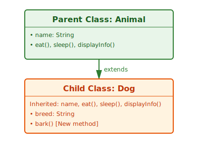
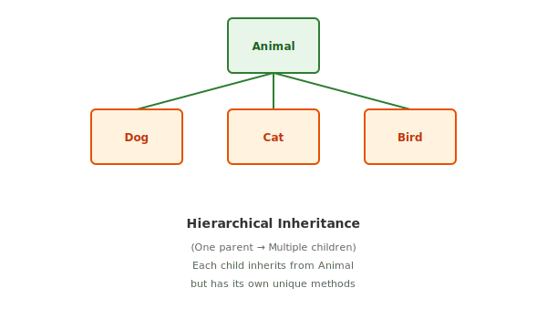
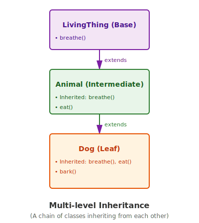
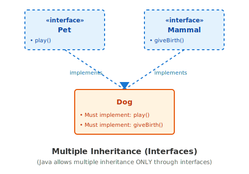
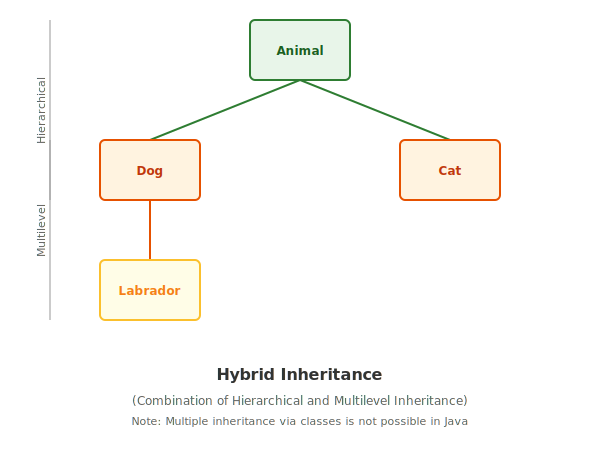

---
tags:
  - java
  - oops
  - inheritance
  - pillar
---

# Inheritance in Java

### TL;DR (Quick Revision)

**Inheritance** = Child class reuses code from Parent class using `extends` keyword

> [!abstract] Core Idea
> Child inherits all non-private members from parent → "is-a" relationship → Promotes code reuse & maintainability → Second pillar of OOP

> [!question] Why Use It?
>
> - Eliminate code duplication (DRY principle)
> - Create class hierarchies that model real-world relationships
> - Enable polymorphism (method overriding)
> - Build extensible & maintainable code

### Quick Inheritance Types Table

| Type                      | Allowed? | Example                    | Visualization                             |
| ------------------------- | :------: | -------------------------- | ----------------------------------------- |
| **Single**                |  ✅ Yes  | Animal → Dog               | 1 parent → 1 child                        |
| **Multilevel**            |  ✅ Yes  | LivingThing → Animal → Dog | Chain: A → B → C                          |
| **Hierarchical**          |  ✅ Yes  | Animal → Dog, Cat, Bird    | 1 parent → N children                     |
| **Hybrid**                |  ✅ Yes  | Mix of above               | Combo (hierarchical + multilevel)         |
| **Multiple**              |  ❌ No   | —                          | NOT allowed for classes (Diamond Problem) |
| **Multiple (Interfaces)** |  ✅ Yes  | Dog implements Pet, Mammal | Use interfaces instead                    |

---

## The Concept

### What Problem Does It Solve?

Imagine creating classes for different animals WITHOUT inheritance:

```java
// BAD - Lots of code duplication
class Dog {
    private String name;
    private int age;

    public void eat() { System.out.println(name + " is eating"); }
    public void sleep() { System.out.println(name + " is sleeping"); }
    public void bark() { System.out.println(name + " is barking"); }
}

class Cat {
    private String name;
    private int age;

    public void eat() { System.out.println(name + " is eating"); }      // DUPLICATE!
    public void sleep() { System.out.println(name + " is sleeping"); }  // DUPLICATE!
    public void meow() { System.out.println(name + " is meowing"); }
}

class Bird {
    private String name;
    private int age;

    public void eat() { System.out.println(name + " is eating"); }      // DUPLICATE!
    public void sleep() { System.out.println(name + " is sleeping"); }  // DUPLICATE!
    public void chirp() { System.out.println(name + " is chirping"); }
}
```

**Problem:** `eat()` and `sleep()` are duplicated 3 times! If we need to fix a bug, we fix it in 3 places.

**Solution: Use Inheritance**

```java
// GOOD - Use a parent class for common code
class Animal {
    private String name;
    private int age;

    public Animal(String name, int age) {
        this.name = name;
        this.age = age;
    }

    public void eat() { System.out.println(name + " is eating"); }
    public void sleep() { System.out.println(name + " is sleeping"); }

    public String getName() { return name; }
    public int getAge() { return age; }
}

// Child classes inherit common code
class Dog extends Animal {
    public Dog(String name, int age) {
        super(name, age);  // Call parent constructor
    }

    public void bark() {
        System.out.println(getName() + " says: Woof! Woof!");
    }
}

class Cat extends Animal {
    public Cat(String name, int age) {
        super(name, age);
    }

    public void meow() {
        System.out.println(getName() + " says: Meow!");
    }
}

class Bird extends Animal {
    public Bird(String name, int age) {
        super(name, age);
    }

    public void chirp() {
        System.out.println(getName() + " says: Chirp chirp!");
    }
}
```

Now `eat()` and `sleep()` are defined **once** in `Animal` — all children inherit them!

### How Java Implements It

#### The `extends` Keyword

```java
class Child extends Parent {
    // Child inherits all non-private members from Parent
}
```

#### What Gets Inherited?

```java
class Parent {
    public int publicField;           // ✅ Child inherits
    protected int protectedField;     // ✅ Child inherits
    int packagePrivateField;          // ✅ Child inherits (if same package)
    private int privateField;         // ❌ Child cannot access

    public void publicMethod() { }    // ✅ Child inherits
    private void privateMethod() { }  // ❌ Child cannot access
}

class Child extends Parent {
    // Can use: publicField, protectedField, packagePrivateField
    // Can call: publicMethod()
    // CANNOT access: privateField, privateMethod()
}
```

#### Full Runnable Example

```java
// Parent class
class Animal {
    private String name;
    private int age;
    protected String species;

    // Constructor
    public Animal(String name, int age, String species) {
        this.name = name;
        this.age = age;
        this.species = species;
        System.out.println("✓ Animal created: " + name);
    }

    // Inherited methods
    public void eat() {
        System.out.println(name + " is eating...");
    }

    public void sleep() {
        System.out.println(name + " is sleeping...");
    }

    public void displayInfo() {
        System.out.println("Name: " + name + ", Age: " + age + ", Species: " + species);
    }

    // Getter
    public String getName() { return name; }
}

// Child class
class Dog extends Animal {
    private String breed;

    // Constructor — must call parent constructor
    public Dog(String name, int age, String breed) {
        super(name, age, "Canine");  // Call parent constructor
        this.breed = breed;
        System.out.println("✓ Dog created with breed: " + breed);
    }

    // New method (only in Dog)
    public void bark() {
        System.out.println(getName() + " barks: Woof! Woof!");
    }

    // Override parent method (we'll see this in Polymorphism)
    @Override
    public void displayInfo() {
        super.displayInfo();  // Call parent's method
        System.out.println("Breed: " + breed);
    }
}

// Another child class
class Cat extends Animal {
    private boolean isIndoor;

    public Cat(String name, int age, boolean isIndoor) {
        super(name, age, "Feline");
        this.isIndoor = isIndoor;
        System.out.println("✓ Cat created, Indoor: " + isIndoor);
    }

    public void meow() {
        System.out.println(getName() + " meows: Meow!");
    }
}

// Main method to demonstrate
public class Main {
    public static void main(String[] args) {
        System.out.println("=== Creating Dog ===");
        Dog dog = new Dog("Buddy", 5, "Golden Retriever");
        dog.eat();              // Inherited method
        dog.sleep();            // Inherited method
        dog.bark();             // Own method
        dog.displayInfo();      // Overridden method

        System.out.println("\n=== Creating Cat ===");
        Cat cat = new Cat("Whiskers", 3, true);
        cat.eat();              // Inherited method
        cat.displayInfo();      // Inherited method
        cat.meow();             // Own method
    }
}
```

**Output:**

```
=== Creating Dog ===
✓ Animal created: Buddy
✓ Dog created with breed: Golden Retriever
Buddy is eating...
Buddy is sleeping...
Buddy barks: Woof! Woof!
Name: Buddy, Age: 5, Species: Canine
Breed: Golden Retriever

=== Creating Cat ===
✓ Animal created: Whiskers
✓ Cat created, Indoor: true
Whiskers is eating...
Name: Whiskers, Age: 3, Species: Feline
Whiskers meows: Meow!
```

### Visual Diagrams:

1. **Single Inheritance**



2. **Hierarchical Inheritance**



3. **Multi-level Inheritance**



4. **Multiple Inheritance (via Interfaces)**



5. **Hybrid Inheritance**



### Key Terminology

1. **Parent Class (Superclass)**: The class being inherited from. Contains common code and behavior.
2. **Child Class (Subclass)**: The class that inherits from the parent. Reuses parent code and adds its own.
3. **`extends` Keyword**: Used to indicate that a class inherits from another: `class Dog extends Animal`
4. **Constructor Chaining**: When a child class calls the parent constructor using `super()`. Ensures parent initialization happens first.
5. **Method Overriding**: When a child class provides its own implementation of a parent method. Enables polymorphism.

> [!important] Key Rules to Remember
>
> - Use **`extends`** keyword to inherit class
> - Use **`implements`** keyword to implement interface
> - Child class is **one-way only** → parent CANNOT access child's members
> - **Private** fields/methods are NOT inherited (but exist in parent)
> - **Public/Protected** members ARE inherited
> - Every class inherits from `Object` by default
> - Call parent constructor using **`super()`** before child initialization

---

## Going Deeper (Intermediate → Advanced)

### Constructor Chaining with `super()`

When you create a child object, the parent constructor **must** run first:

```java
class Animal {
    private String name;

    public Animal(String name) {
        this.name = name;
        System.out.println("Animal constructor called for: " + name);
    }
}

class Dog extends Animal {
    private String breed;

    public Dog(String name, String breed) {
        super(name);  // MUST call parent constructor first
        this.breed = breed;
        System.out.println("Dog constructor called for breed: " + breed);
    }
}

public static void main(String[] args) {
    Dog dog = new Dog("Buddy", "Golden Retriever");
}

// Output:
// Animal constructor called for: Buddy
// Dog constructor called for breed: Golden Retriever
```

> [!warning] Missing `super()` = Compile Error
> If parent has a constructor with parameters, child **must** explicitly call it with `super(...)`. Otherwise: `Implicit super constructor Animal() is undefined`

### Method Overriding (Foundation of Polymorphism)

Child class can provide its own implementation of a parent method:

```java
class Animal {
    public void sound() {
        System.out.println("Some generic animal sound");
    }
}

class Dog extends Animal {
    @Override  // Annotation (optional but recommended)
    public void sound() {
        System.out.println("Woof! Woof!");  // Override with Dog-specific implementation
    }
}

class Cat extends Animal {
    @Override
    public void sound() {
        System.out.println("Meow!");  // Override with Cat-specific implementation
    }
}

public static void main(String[] args) {
    Dog dog = new Dog();
    Cat cat = new Cat();

    dog.sound();  // Output: Woof! Woof!
    cat.sound();  // Output: Meow!
}
```

**Rules for Overriding:**

- Method name must be **same**
- Parameters must be **same** (same type and order)
- Return type must be **same** (or covariant)
- **Cannot** reduce visibility (e.g., `public` → `private`)
- **Cannot** throw broader exceptions
- Use `@Override` annotation for clarity

### The `super` Keyword

`super` refers to the parent class and is used in two ways:

**1. Call parent constructor:**

```java
super();              // Call parameterless parent constructor
super(name, age);     // Call parent constructor with parameters
```

**2. Call parent method:**

```java
class Animal {
    public void eat() { System.out.println("Animal eating..."); }
}

class Dog extends Animal {
    @Override
    public void eat() {
        super.eat();  // Call parent's eat()
        System.out.println("Dog eating meat");
    }
}

// Output:
// Animal eating...
// Dog eating meat
```

### Multilevel Inheritance (Chain of Inheritance)

A child can itself be a parent:

```java
class LivingThing {
    public void breathe() { System.out.println("Breathing..."); }
}

class Animal extends LivingThing {
    public void eat() { System.out.println("Eating..."); }
}

class Dog extends Animal {
    public void bark() { System.out.println("Barking..."); }
}

// Inheritance chain: LivingThing → Animal → Dog
Dog dog = new Dog();
dog.breathe();  // Inherited from LivingThing (2 levels up)
dog.eat();      // Inherited from Animal (1 level up)
dog.bark();     // Own method
```

**Visualization:**

```
LivingThing (Level 0)
    ↓ extends
Animal (Level 1)
    ↓ extends
Dog (Level 2)
```

### The `final` Keyword in Inheritance

Prevent overriding or inheritance:

```java
// Prevent a method from being overridden
class Parent {
    final public void importantMethod() {
        System.out.println("This cannot be overridden");
    }
}

class Child extends Parent {
    @Override
    public void importantMethod() {  // COMPILE ERROR!
        // Error: Cannot override final method
    }
}

// Prevent a class from being extended
final class ImmutableClass {
    // No class can extend this
}

class Derived extends ImmutableClass {  // COMPILE ERROR!
    // Error: Cannot extend final class
}
```

### Abstract Classes vs Concrete Classes

**Abstract class:** Cannot be instantiated, meant to be extended:

```java
abstract class Animal {
    abstract void sound();  // Child must implement

    public void eat() { System.out.println("Eating"); }  // Optional override
}

class Dog extends Animal {
    @Override
    void sound() {
        System.out.println("Woof!");  // MUST implement abstract method
    }
}

// Animal animal = new Animal();  // ERROR! Cannot instantiate abstract
Animal animal = new Dog();          // OK! Use child instance
```

### The Liskov Substitution Principle (LSP)

A child object should be usable wherever the parent is expected:

```java
class Animal {
    public void move() { System.out.println("Moving"); }
}

class Dog extends Animal {
    @Override
    public void move() { System.out.println("Dog running"); }
}

class Cat extends Animal {
    @Override
    public void move() { System.out.println("Cat walking"); }
}

public static void main(String[] args) {
    // LSP: We can treat Dog and Cat as Animals
    Animal dog = new Dog();
    Animal cat = new Cat();

    dog.move();  // Output: Dog running
    cat.move();  // Output: Cat walking
}
```

### Multiple Inheritance Problem: Diamond Problem

Why Java doesn't allow multiple class inheritance:

```text
           Father
          /      \
         /        \
  GrandChild      Mother
         \        /
          \      /
           Diamond
```

If `GrandChild` extends both `Father` and `Mother`, and both define `snore()`, which one does `GrandChild.snore()` call?

**Solution: Use Interfaces (Java 8+)**

```java
interface Father {
    default void snore() { System.out.println("Father...snore"); }
}

interface Mother {
    default void snore() { System.out.println("Mother...snore"); }
}

class GrandChild implements Father, Mother {
    @Override
    public void snore() {
        Father.super.snore();   // Explicitly choose Father's snore
        Mother.super.snore();   // Explicitly choose Mother's snore
    }
}
```

### Connecting to Other OOP Concepts

**Inheritance + Polymorphism:**

```java
Animal animal = new Dog();  // Parent reference, child object
animal.sound();             // Calls Dog's sound() (polymorphism)
```

**Inheritance + Encapsulation:**

```java
class Animal {
    private String name;       // Encapsulated (hidden)

    public String getName() {  // Access through getter
        return name;
    }
}

class Dog extends Animal {
    public void bark() {
        System.out.println(getName() + " barks");  // Access through inherited getter
    }
}
```

**Inheritance + Abstraction:**

```java
abstract class Shape {
    abstract double getArea();  // Abstract method (hides complexity)
}

class Circle extends Shape {
    private double radius;

    @Override
    double getArea() {
        return Math.PI * radius * radius;  // Implementation hidden
    }
}
```

---

## Interview Corner

### Common Questions & Concise Answers

**Q1: What is inheritance?**  
A: A mechanism where a child class reuses code from a parent class using the `extends` keyword. Promotes code reuse and models "is-a" relationships.

**Q2: What are the types of inheritance?**  
A: Single (1 parent → 1 child), Multilevel (A → B → C), Hierarchical (1 parent → N children), and Hybrid (combo of above). Multiple inheritance is NOT allowed for classes due to the Diamond Problem.

**Q3: Can a child class access private members of parent?**  
A: No. Private members are only accessible within the class they're defined in. Child classes inherit the functionality but cannot access the private fields directly.

**Q4: What does `super()` do?**  
A: It calls the parent class constructor. Used when you need to initialize parent state before initializing child state.

**Q5: What's the difference between method overriding and method overloading?**  
A: Overriding = child provides new implementation of parent method (same signature). Overloading = multiple methods with same name but different parameters (same class).

**Q6: Why doesn't Java support multiple inheritance?**  
A: Because of the Diamond Problem — if a child inherits from two parents with the same method, it's ambiguous which to call. Solution: use interfaces instead.

**Q7: Can you override a `private` method?**  
A: No. Private methods are not inherited, so they cannot be overridden. A child class can define its own method with the same name, but it's a new method, not an override.

**Q8: What's an abstract class used for?**  
A: To define a common interface for its subclasses. Abstract classes cannot be instantiated and typically contain abstract methods that children must implement.

**Q9: What's the Liskov Substitution Principle?**  
A: A child class object should be usable wherever a parent class object is expected without breaking the code.

**Q10: How does inheritance relate to polymorphism?**  
A: Inheritance creates the class hierarchy. Polymorphism (method overriding) lets child objects be used through parent references, calling child-specific implementations.

### Classic Mistakes / Traps

❌ **Mistake 1:** Forgetting to call `super()` in child constructor

```java
class Child extends Parent {
    public Child(String name) {
        // Missing super(name) — ERROR!
        this.name = name;
    }
}
```

✅ **Fix:** Always call parent constructor first:

```java
public Child(String name) {
    super(name);
    // child-specific initialization
}
```

❌ **Mistake 2:** Trying to override a `private` method

```java
class Parent {
    private void secret() { }
}

class Child extends Parent {
    @Override
    private void secret() { }  // NOT an override (private not inherited)
}
```

✅ **Fix:** Use `protected` or `public` if you want overridability.

❌ **Mistake 3:** Breaking Liskov Substitution by changing method behavior

```java
class Animal {
    public void move() { /* move forward */ }
}

class Penguin extends Animal {
    @Override
    public void move() { /* can't move (swim instead) */ }  // LSP violation!
}
```

✅ **Fix:** Use interfaces or abstract classes for "can-do" vs "is-a" relationships.

❌ **Mistake 4:** Accessing parent's private fields with getter from child

```java
class Parent {
    private int data;
    public int getData() { return data; }
}

class Child extends Parent {
    public Child() {
        this.data = 10;  // ERROR! Cannot access private field directly
    }
}
```

✅ **Fix:** Use the inherited getter/setter:

```java
public Child(int value) {
    setData(value);  // Use parent's setter
}
```

❌ **Mistake 5:** Deep inheritance hierarchies (too many levels)

```java
A → B → C → D → E → F  // Hard to follow, maintain, understand
```

✅ **Fix:** Keep hierarchies shallow (2-3 levels max), use composition for combinations.

---

## Practice Exercises

**Exercise 1: Single Inheritance with Constructor Chaining**  
Create a `Vehicle` parent class with `name` and `speed`. Create a `Car` child with `fuelType`. Write a main() that creates a Car and calls inherited methods.

**Exercise 2: Method Overriding**  
Create an `Employee` parent with `salary` and method `calculateBonus()`. Create `Manager` child that overrides `calculateBonus()` (adds percentage). Demonstrate polymorphism using parent reference.

**Exercise 3: Multilevel Inheritance**  
Create a hierarchy: `LivingThing` → `Animal` → `Pet` → `Dog`. Each level adds one method. Show that Dog inherits all methods from all ancestors.

**Exercise 4: Abstract Class**  
Create abstract class `Shape` with abstract method `getArea()`. Create concrete classes `Circle` and `Rectangle`. Demonstrate that Shape cannot be instantiated but parent reference can point to child objects.

**Exercise 5: Real-World Example**  
Create an online shopping system with `Product` parent class (price, description) and children like `Electronics`, `Clothing`, `Food`. Each child overrides a method like `getDiscount()` or `canBeShipped()`.

---

## Quick Reference Card

### Access Modifiers in Inheritance

| Modifier    | Parent Access | Child Access (same package) | Child Access (diff package) | Others |
| ----------- | :-----------: | :-------------------------: | :-------------------------: | :----: |
| `private`   |      ✅       |             ❌              |             ❌              |   ❌   |
| `default`   |      ✅       |             ✅              |             ❌              |   ❌   |
| `protected` |      ✅       |             ✅              |             ✅              |   ❌   |
| `public`    |      ✅       |             ✅              |             ✅              |   ✅   |

### Inheritance Rules Quick List

✅ **DO:**

- Use `extends` for single inheritance
- Call `super()` in child constructor
- Use `@Override` annotation for clarity
- Keep inheritance hierarchies shallow
- Extract common code into parent class
- Use `protected` for members meant for children

❌ **DON'T:**

- Attempt multiple class inheritance
- Forget `super()` call in constructor
- Assume parent can access child members
- Create deep inheritance chains (>3 levels)
- Override `private` methods
- Make inheritance hierarchy so complex it's hard to understand

### Memory Trick

> [!tip] **"IS-A" Test**
> If you can say "X IS-A Y", use inheritance.
>
> - ✅ "Dog IS-A Animal" → Use inheritance
> - ✅ "Car IS-A Vehicle" → Use inheritance
> - ❌ "Car HAS-A Engine" → Use composition (not shown here)
>
> Inheritance = IS-A relationship
> Composition = HAS-A relationship

---

## ⚡ Edge Case Analysis

### 1. The Circular Inheritance Trap

**Scenario:** `class A extends B` and `class B extends A`.
**Outcome:** Compile Error. Java does not allow circular dependency as it would lead to an infinite initialization loop.

### 2. Variable Shadowing

**Scenario:** Child class defines a variable with the same name as a parent class variable.
**Problem:** The child's variable "shadows" the parent's. Accessing it via a parent reference will return the parent's value, not the child's.

```java
class Parent { String name = "Parent"; }
class Child extends Parent { String name = "Child"; }

Parent p = new Child();
System.out.println(p.name); // Prints "Parent" (Variables are not polymorphic!)
```

### 3. Private Member Access

**Scenario:** Accessing private fields of a parent directly in the child.
**Outcome:** Compile Error. Use `public` or `protected` getters/setters instead.

---

## 🙋 Interview Corner

**Q1: Why doesn't Java support multiple inheritance with classes?**
A: To avoid the **Diamond Problem** (ambiguity). If two parents have a method with the same signature, the child wouldn't know which one to inherit. Java uses **Interfaces** to solve this.

**Q2: Difference between `this()` and `super()`?**

- `this()`: Calls another constructor in the **same** class.
- `super()`: Calls a constructor in the **parent** class.
- _Rule:_ Both must be the first line in a constructor, so you cannot use both in the same constructor.

**Q3: Can we inherit constructors?**
A: **No.** Constructors are not members of a class. However, the child constructor _must_ call the parent constructor (either implicitly or explicitly using `super()`).

**Q4: What is the Liskov Substitution Principle (LSP)?**
A: It states that objects of a superclass should be replaceable with objects of a subclass without affecting the correctness of the program. "If it's an Animal, it should behave like an Animal, even if it's actually a Dog."

**Q5: Can a class extend itself?**
A: No, that would be circular inheritance.

---

## One-liner to Remember

> **Inheritance = "Is-A" relationship + Code Reuse + Foundation for Polymorphism.**
