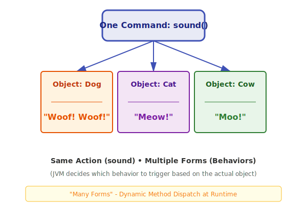

---
tags:
  - java
  - oops
  - polymorphism
  - pillar
---

# Polymorphism in Java

**Polymorphism** means "many forms" — one entity (method name) shows different behaviors in different situations.

Two main types in Java:

- **Compile-time** (static/early binding) → Method Overloading
- **Runtime** (dynamic/late binding) → Method Overriding
 
 ### Visual Diagram: Polymorphism in Action
 
 

> [!abstract] Why Polymorphism?
> Makes code flexible, reusable, and supports "write once, behave differently" based on object type.

## 1. Compile-time Polymorphism: Method Overloading

Same method name in the **same class**, but different parameter lists (signature).

**Rules for Method Overloading**

- Method name **same**
- Parameters must differ in:
  - Number
  - Type
  - Order (sequence)
- Return type **does NOT** count (can't overload just by changing return type)
- Access modifiers can be anything
- Can overload constructors too

```java
class Calculator {
    void add(int a, int b) {
        System.out.println("int + int = " + (a + b));
    }

    void add(double a, double b) {          // different type
        System.out.println("double + double = " + (a + b));
    }

    void add(int a, int b, int c) {         // different number
        System.out.println("three ints = " + (a + b + c));
    }
}
```

> [!example] In main():
>
> ```java
> Calculator c = new Calculator();
> c.add(5, 10);           // calls int version
> c.add(5.5, 10.5);       // calls double version
> ```

**Key point**: Compiler decides at compile time — no runtime magic.

## 2. Runtime Polymorphism: Method Overriding

Child class provides its own implementation of a parent's method.

**Rules for Method Overriding**

- Must be in **inheritance** (child class)
- Method **name + parameters** (signature) **exactly same**
- Return type: same **or covariant** (subclass type allowed, e.g., parent returns Animal, child returns Dog)
- Access modifier **cannot be narrower** (public → public; protected → protected or public)
- Cannot override: **private**, **static**, **final** methods
- Constructors **cannot** be overridden (use `super()` to call parent)
- Use `@Override` annotation — good practice, catches mistakes

```java
class Animal {
    void sound() {
        System.out.println("Animal sound");
    }
}

class Dog extends Animal {
    @Override
    void sound() {
        System.out.println("Dog barks");
    }
}

class Cat extends Animal {
    @Override
    void sound() {
        System.out.println("Cat meows");
    }
}
```

> [!example] Runtime magic:
>
> ```java
> Animal a1 = new Dog();    // reference Animal, object Dog
> Animal a2 = new Cat();
>
> a1.sound();   // Dog barks (JVM checks actual object at runtime)
> a2.sound();   // Cat meows
> ```

**Upcasting** is key here → parent reference holding child object.

## Overloading vs Overriding – Quick Comparison

| Feature              | Method Overloading     | Method Overriding         |
| -------------------- | ---------------------- | ------------------------- |
| Location             | Same class             | Child class (inheritance) |
| Signature            | Must differ            | Must be identical         |
| Binding              | `Compile-time` (early) | `Runtime` (late)          |
| Return type          | Can differ             | Same or covariant         |
| Access modifier      | No restriction         | Cannot reduce visibility  |
| Static/private/final | Allowed                | Not allowed               |
| Annotation           | Not needed             | `@Override` recommended   |

> [!tip] Memory Trick
>
> - Over**loading** = Overloading a truck with **different** stuff (params) → same truck name, different loads.
> - Over**riding** = Child **overrides** parent's decision → same rule, but child's way wins when called.
> - Polymorphism = "One name, many actions" — overloading at compile, overriding at runtime.

> [!warning] Common Mistakes
>
> - Changing only return type for overloading → compile error.
> - Making child method private when parent is public → compile error.
> - Trying to override static method → compiles but no polymorphism (calls based on reference type).

---

## ⚡ Edge Case Analysis

### 1. Static Method Hiding (Not Overriding)

**Scenario:** Parent and Child both have the same `static` method.
**Problem:** Static methods are not polymorphic. The method called depends on the **reference type**, not the actual object.

```java
Animal a = new Dog();
a.staticMethod(); // Calls Animal's staticMethod (Hiding)
```

### 2. Variable Hiding

**Scenario:** Both classes have a variable `int x`.
**Fact:** Like static methods, variables are not overridden. The reference type determines which variable is accessed.

### 3. Covariant Return Types

**Scenario:** Parent method returns `Animal`, child override returns `Dog`.
**Fact:** This is allowed in Java 5+. It makes the code more specific and avoids casting.

---

## 🙋 Interview Corner

**Q1: Can we overload a method by changing only the return type?**
A: **No.** The compiler distinguishes methods by their signature (name + parameters). Return type is not part of the signature.

**Q2: Can we override a `private` method?**
A: **No.** Private methods are not visible to the subclass, so the child just creates a "new" method with the same name. No polymorphism occurs.

**Q3: What is "Upcasting" vs "Downcasting"?**

- **Upcasting:** `Parent p = new Child();` (Always safe, implicit).
- **Downcasting:** `Child c = (Child) p;` (Dangerous, needs explicit cast and `instanceof` check).

**Q4: Does Java support "Operator Overloading"?**
A: **No**, except for the `+` operator with Strings. Java designers avoided it to keep the language simple.

**Q5: Why is `@Override` used?**
A: It's an instruction to the compiler to check if a method is actually overriding a parent method. If you make a typo in the name or params, the compiler will throw an error instead of treating it as a new method.

---

## One-liner to Remember

> **Polymorphism = One interface, multiple implementations (Early binding for Overloading, Late binding for Overriding).**
