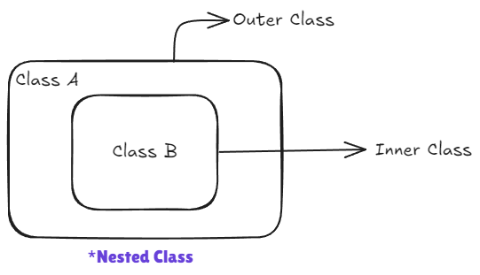

---
tags:
  - java
  - oops
  - nested-class
---

# Nested Classes



Nested classes allow you to logically group classes that are only used in one place, which increases encapsulation and creates more maintainable code.

1. **Static Nested Class**
   Let's say we have:

   ```java
   Class A{
      static Class B{

      }
   }
   ```

2. **Inner Class** (non-static)
   - (Regular Inner Class) Member Inner Class
   - Anonymous Class
   - Local Inner Class

---

> [!abstract] What is a Nested Class (Inner Class)?
> A **nested class** is simply a class written **inside another class**.  
> The outer class is called **Outer Class** (or Enclosing Class).  
> The class written inside is called **Inner Class** or **Nested Class**.
>
> Just like how you keep a small box inside a big box — the inner box is private to the big box and can access its things easily.

**Why do we even need Nested Classes?** (Simple real-life reason)

- **Better Encapsulation** — Hide the helper class completely inside the main class so no one outside can use it directly.
- **Logical Grouping** — If a class is only useful for one specific outer class (e.g., a "Node" class only used inside "LinkedList"), keep it inside.
- **Access** — Inner class can directly access **private** members of outer class (even private variables!). This is the biggest advantage.
- **Cleaner code** — No separate .java file for small helper classes.
- **Anonymous Inner Class** is super powerful for implementing interfaces or abstract classes on-the-fly (without creating a full named class).

> [!tip] Important Rule
> Nested classes are still **normal classes** — they can have constructors, methods, variables, everything.  
> But their **scope and access** changes depending on the type.

Java has **4 types** of Nested Classes. The video explains all of them clearly with examples.

## 1. Member Inner Class (Most Common Non-Static Inner Class)

This is a **non-static** class written directly inside the outer class (like a normal member).

**Key Points (explained simply):**

- It is **tied to an object** of the outer class.
- To create its object, you **must first create** outer class object.
- It can access **all** members of outer class (private, protected, public, static, non-static — everything!).
- Outer class can access inner class members only through an inner object.

**Full Code Example** (typical from such lectures)

```java
// Outer Class
class Outer {
    private int outerVar = 100;     // private variable - inner can still access!

    // Member Inner Class
    class Inner {
        private int innerVar = 200;

        void show() {
            System.out.println("Outer variable (private) = " + outerVar);   // direct access!
            System.out.println("Inner variable = " + innerVar);
        }
    }
}

// How to use in main()
public class Main {
    public static void main(String[] args) {
        Outer outerObj = new Outer();           // Step 1: Create outer object

        // Step 2: Create inner object using outer object
        Outer.Inner innerObj = outerObj.new Inner();   // special syntax!

        innerObj.show();   // Output: Outer variable (private) = 100
                           //         Inner variable = 200
    }
}
```

**Line-by-line Explanation:**

- `Outer.Inner innerObj = outerObj.new Inner();` — This is the special syntax for member inner class. You use `outerObject.new InnerClassName()`.
- If you try `new Inner()` directly, it will give error — because inner class needs outer instance.

**When to use?** When the inner class is tightly related and needs to access private data of outer.

## 2. Static Nested Class

This is **static** version of nested class.

**Key Points (very important difference):**

- It behaves almost like a normal outer class.
- It can be created **without** creating outer class object (just `new Outer.StaticInner()`).
- It can **only** access **static** members of the outer class (not non-static/private instance variables).
- Used when you want to group classes logically but don't need outer instance access.

**Full Code Example**

```java
class Outer {
    private static int staticVar = 500;   // static variable
    private int nonStaticVar = 600;       // non-static - cannot access from static nested!

    // Static Nested Class
    static class StaticInner {
        void display() {
            System.out.println("Static variable from outer = " + staticVar);
            // System.out.println(nonStaticVar);  // ERROR! Cannot access non-static
        }
    }
}

public class Main {
    public static void main(String[] args) {
        // No need to create Outer object!
        Outer.StaticInner si = new Outer.StaticInner();
        si.display();
    }
}
```

**Memory Trick:** Static Nested = "Independent flatmate" — lives in same house but doesn't need owner's permission for everything.

## 3. Local Inner Class

This class is declared **inside a method** of the outer class (local to that method only).

**Key Points:**

- Scope is only inside that method (like a local variable).
- Can access outer class members + **final** or **effectively final** local variables of the method.
- Rarely used, but good for one-time small logic.

**Full Code Example**

```java
class Outer {
    private int data = 1000;

    void outerMethod() {
        final int localVar = 50;   // must be final or effectively final

        // Local Inner Class - defined inside method
        class LocalInner {
            void localShow() {
                System.out.println("Outer data = " + data);
                System.out.println("Local variable = " + localVar);
            }
        }

        LocalInner li = new LocalInner();   // create here only
        li.localShow();
    }
}

public class Main {
    public static void main(String[] args) {
        Outer o = new Outer();
        o.outerMethod();   // works only inside this method
    }
}
```

## 4. Anonymous Inner Class (The Most Powerful & Most Used!)

This is a class **without a name** — created on the spot using `new`.

**Why it's awesome:**

- Used when you need to implement an **interface** or extend an **abstract class** for **one-time use** only.
- No need to create a separate named class.
- Perfect for event listeners, callbacks, threads, etc.

**Two Super-Important Cases Explained Deeply:**

### Case 1: Implementing Interface using Anonymous Inner Class

```java
interface Animal {           // Normal interface (from your previous notes)
    void sound();
}

public class Main {
    public static void main(String[] args) {

        // Anonymous Inner Class implementing interface
        Animal dog = new Animal() {          // no class name!
            @Override
            public void sound() {
                System.out.println("Dog barks - Woof Woof!");
            }
        };

        dog.sound();   // Output: Dog barks - Woof Woof!
    }
}
```

**Explanation:**  
You are creating an object of an **unnamed class** that implements `Animal`.  
This unnamed class overrides `sound()` immediately.  
No need to write `class Dog implements Animal {}` — saves time for one-time use.

### Case 2: Extending Abstract Class using Anonymous Inner Class

```java
abstract class Vehicle {
    abstract void start();

    void stop() {
        System.out.println("Vehicle stopped.");
    }
}

public class Main {
    public static void main(String[] args) {

        Vehicle bike = new Vehicle() {     // anonymous extending abstract class
            @Override
            void start() {
                System.out.println("Bike started with kick!");
            }
        };

        bike.start();   // Bike started with kick!
        bike.stop();    // Vehicle stopped.
    }
}
```

**Deep Connection to Your Previous Notes:**

- Remember **Abstraction**? Abstract classes and interfaces cannot be instantiated directly.
- Anonymous Inner Class solves this — it provides the missing implementation **on the spot**.
- This is how many real apps (Android buttons, Swing listeners, Threads) work without creating 50 extra classes.

## Quick Comparison Table (All 4 Types)

| Type                  | Needs Outer Object? | Can Access Private of Outer? | Can be Static? | Use Case                                   |
| --------------------- | ------------------- | ---------------------------- | -------------- | ------------------------------------------ |
| Member Inner Class    | Yes                 | Yes                          | No             | Tight helper class                         |
| Static Nested Class   | No                  | Only static members          | Yes            | Logical grouping without dependency        |
| Local Inner Class     | Yes                 | Yes + final locals           | No             | One-time logic inside method               |
| Anonymous Inner Class | Yes                 | Yes                          | No             | Quick implementation of interface/abstract |

> [!success] Memory Trick
>
> - **Member** = Regular family member (needs parent to exist)
> - **Static** = Independent tenant (can live alone)
> - **Local** = Temporary guest inside one room only
> - **Anonymous** = Masked superhero who appears only once and saves the day (implements interface/abstract instantly)

> [!warning] Important Rules
>
> - Inner classes cannot have **static** members (except static nested).
> - You cannot make local/anonymous class **public/private/protected**.
> - Anonymous class is used **heavily** in real projects for callbacks and event handling.

---

## 🙋 Interview Corner

**Q1: Why can't a non-static inner class have static members?**
A: Because a non-static inner class is tied to an _instance_ of the outer class. Static members belong to the _class_ itself, and having them inside an instance-dependent class would be logically inconsistent.

**Q2: What is the difference between `Outer.this` and `this`?**
A: Inside an inner class, `this` refers to the inner class instance. To refer to the outer class instance, you must use `OuterName.this`.

**Q3: When should you use a Static Nested Class over an Inner Class?**
A: Use a **Static Nested Class** if the nested class does not need access to the instance variables or methods of the outer class. It is more memory-efficient as it doesn't hold a reference to the outer object.

**Q4: Can we instantiate an Inner Class from a static method of the Outer Class?**
A: No, not directly. Since the inner class needs an outer object, you must first create an outer instance: `new Outer().new Inner()`.

**Q5: What are effectively final variables?**
A: A variable that is not declared `final` but whose value is never changed after initialization. Local inner classes and lambda expressions can only access such variables from their enclosing scope.

---

## One-liner to Remember

> **Nested Classes = Boxes inside boxes (Static is independent, Member needs a parent, Local is a method guest, Anonymous is a one-time hero).**
