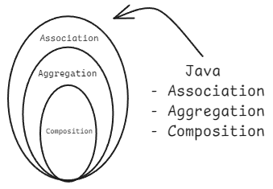

---

> [!abstract] Core Idea – Relationships Between Classes
> In real life, objects are connected in different ways.  
> In OOP, we model these connections using **Association**, **Aggregation**, and **Composition**.
>
> These concepts show **"how classes/objects relate to each other"** (Has-A relationship).  
> They are very important for designing good, maintainable code and understanding real-world modeling (e.g., Car and Engine, University and Students, Person and Address).

**Analogy (Simple Language):**

- Think of a **Person** and **Mobile Phone**.
  - **Association** = Loose connection (Person **uses** a Phone – can change phone anytime).
  - **Aggregation** = Weak ownership (Person **has** a Team of friends – team can exist without the person).
  - **Composition** = Strong ownership (Person **has** a Heart – heart cannot exist without the person; if person dies, heart also gone).

All three come under **"Has-A"** relationship (opposite of Inheritance which is "Is-A").

## 1. Association (Loose Relationship)

- **General "Has-A"** or "Uses-A" relationship.
- Objects are connected but **independent**.
- One object can exist without the other.
- Can be **one-way** or **two-way** (bidirectional).
- No ownership – just a reference.

**Real-life Example:** Teacher and Student  
→ A teacher teaches many students.  
→ A student can have many teachers.  
→ If teacher leaves, students still exist.

```java
class Teacher {
    String name;
    Teacher(String name) { this.name = name; }
}

class Student {
    String name;
    List<Teacher> teachers;   // Student has reference to Teachers

    Student(String name) {
        this.name = name;
        this.teachers = new ArrayList<>();
    }

    void addTeacher(Teacher t) {
        teachers.add(t);
    }
}

public class AssociationDemo {
    public static void main(String[] args) {
        Teacher t1 = new Teacher("Mr. Sharma");
        Student s1 = new Student("Rahul");

        s1.addTeacher(t1);   // Association created

        // Both objects can exist independently
    }
}
```

**Key Points:**

- Weakest relationship among the three.
- Uses references (member variables).
- Flexible – easy to change connections.

## 2. Aggregation (Weak "Has-A" / "Part-Of" with Independent Lifetime)

- Special type of Association.
- **"Has-A"** with **weak ownership**.
- The **part** can exist **without** the **whole**.
- Whole object contains collection of parts, but parts are **not destroyed** when whole is destroyed.
- Represents "whole-part" relationship where part has independent life.

**Real-life Example:** University and Department / Student  
→ University **has** many Departments.  
→ If University closes, Departments can still exist (or move to another university).  
→ Departments are not "owned" strongly by University.

**Code Example**

```java
class Department {
    String deptName;
    Department(String name) { this.deptName = name; }
}

class University {
    String uniName;
    List<Department> departments;   // Aggregation

    University(String name) {
        this.uniName = name;
        this.departments = new ArrayList<>();
    }

    void addDepartment(Department d) {
        departments.add(d);
    }
}

// In main():
University u = new University("IIT Bombay");
Department cs = new Department("Computer Science");

u.addDepartment(cs);

// Even if u is set to null, cs Department object still exists independently
```

**Key Points:**

- "Whole" has "parts", but parts have their own life.
- Usually implemented using collections (`List`, `Set`).
- No strong lifecycle dependency.

## 3. Composition (Strong "Has-A" / "Part-Of" with Dependent Lifetime)

- Strongest form of Association.
- **"Has-A"** with **strong ownership**.
- The **part** **cannot exist** without the **whole**.
- If whole object is destroyed, its parts are also destroyed.
- Represents **"exclusive ownership"**.

**Real-life Example:** Car and Engine  
→ Car **has** an Engine.  
→ Engine is created inside Car.  
→ If Car is destroyed, Engine is also destroyed (cannot use same engine in another car easily).

**Code Example**

```java
class Engine {
    String type;
    Engine(String type) { this.type = type; }

    void start() {
        System.out.println(type + " engine started");
    }
}

class Car {
    String model;
    private Engine engine;   // Composition - Engine is part of Car

    Car(String model) {
        this.model = model;
        this.engine = new Engine("Petrol");   // Engine created inside Car
    }

    void startCar() {
        engine.start();
        System.out.println(model + " car is running");
    }
}

public class CompositionDemo {
    public static void main(String[] args) {
        Car myCar = new Car("Swift");
        myCar.startCar();

        // When myCar object is destroyed, its engine is also gone
    }
}
```

**Key Points:**

- Part object is created inside the whole class.
- Part has **private** access (strong encapsulation).
- Strongest dependency – lifecycle of part is controlled by whole.

## Quick Comparison Table (Very Important for Revision)

| Relationship    | Type of "Has-A" | Ownership Strength | Part Exists Without Whole? | Lifetime Dependency              | Example                     |
| --------------- | --------------- | ------------------ | -------------------------- | -------------------------------- | --------------------------- |
| **Association** | General         | None / Loose       | Yes                        | Independent                      | Person – Mobile Phone       |
| **Aggregation** | Weak Has-A      | Weak               | Yes                        | Independent                      | University – Department     |
| **Composition** | Strong Has-A    | Strong             | **No**                     | Dependent (part dies with whole) | Car – Engine / House – Room |

> [!success] Memory Trick (Simple & Effective)
>
> - **Association** = "Friends" – can meet, but live separately.
> - **Aggregation** = "Team" – team members can leave and join another team.
> - **Composition** = "Body Parts" – hand cannot live without body.
>
> **A → Aggregation** (weak, "A" for Average)  
> **C → Composition** (strong, "C" for Complete ownership)

> [!tip] When to Use Which?
>
> - Use **Association** for simple references.
> - Use **Aggregation** when parts can be shared or reused (e.g., many universities sharing professors).
> - Use **Composition** when part belongs **exclusively** to whole and has no meaning alone (most common in good design).

> [!warning] Common Mistakes
>
> - Confusing Aggregation and Composition (lifecycle is the main difference).
> - Making everything Composition → too rigid design.
> - Not using proper access modifiers (private for composition).
