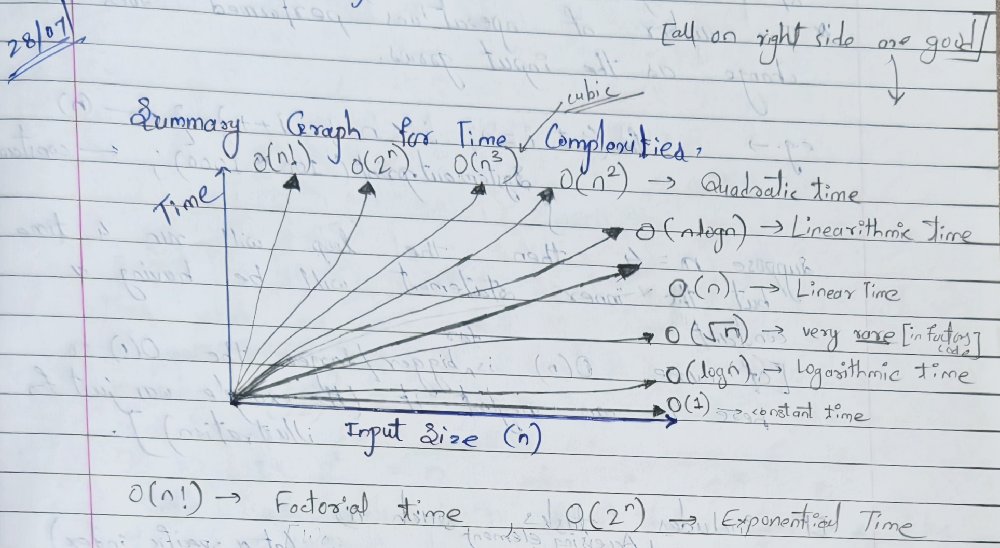
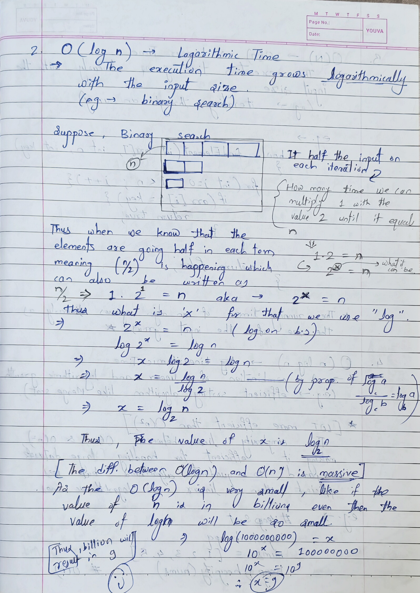
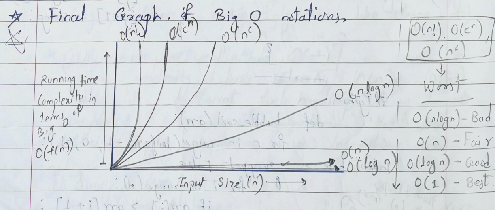

# Time Complexity & Space Complexity

> [!IMPORTANT] Definition of Complexity
>
> - Time and Space Complexity are the key factors which dictate how much time and space an algorithm will take on its operations and execution.
> - Time and Space Complexity refers to the efficiency of an algorithm, measuring how its runtime and memory usage scale as the input size increases. Time complexity measures operations, while space complexity measures auxiliary memory, often expressed using Big-O notation to analyze worst-case scenarios and optimize performance

> [!INFO] Time Complexity
> **Time Complexity** measures the amount of time an algorithm takes to complete as a function of the input size. It's a way to estimate the **running time of an algorithm**.

> [!INFO] Space Complexity
> **Space Complexity** measures the amount of auxiliary memory (additional space beyond the input) required by an algorithm to perform its operations. It's a way to estimate the **memory usage of an algorithm**.

### **Summary Graph for Time Complexity**



| Notation         | Name                  | Growth Rate                                                   |
| ---------------- | --------------------- | ------------------------------------------------------------- |
| $O(1)$           | **Constant Time**     | Time stays the same regardless of input size.                 |
| $O(\log n)$<br>  | **Logarithmic Time**  | Time grows slowly as input size increases.                    |
| $O(\sqrt{n})$    | **Square Root**       | Very rare; often seen in primality tests or factors.          |
| $O(n)$           | **Linear Time**       | Time grows proportionally with input size.                    |
| $O(n \log n)$    | **Linearithmic Time** | Common in efficient sorting algorithms (e.g., Merge Sort).    |
| $O(n^{2})$       | **Quadratic Time**    | Time grows with the square of the input (e.g., nested loops). |
| $O(n^{3})$       | **Cubic Time**        | Higher-order polynomial growth.                               |
| $O(2^{n})$       | **Exponential Time**  | Growth doubles with each addition to the input.               |
| $O(n!)$          | **Factorial Time**    | The fastest growth; becomes impractical very quickly.         |

### Notations

Time complexity notation, often referred to as **asymptotic notation**, is ==a mathematical shorthand used in computer science to describe how the execution time of an algorithm grows as the input size increases==. Rather than measuring actual seconds (which varies by machine), it counts the number of elementary operations.

| Notations                       | Complexity   |
| ------------------------------- | ------------ |
| Big-O Notation ($O$ notation)   | Worst case   |
| Omega Notation ($Ω$ notation)   | Best case    |
| Theta Notation ($Θ$ notation)   | Average case |

1. **Theta ($Θ$)** notation encloses the function from above and below; it represents both the **upper bound** and the **lower bound** of an algorithm, hence representing the **average-case** complexity.

2. **Big-$O$ notation** represents the upper bound of the running time of an algorithm. Therefore, it gives the **worst-case** complexity of an algorithm.

3. **Omega ($Ω$) notation** represents the lower bound of the running time of an algorithm. Thus, it provides the **best-case** complexity of an algorithm.

> [!INFO] Upper Bound
> **Upper Bound**
> → Represented by **Big-$O$** notation, the upper bound defines the **maximum** amount of time an algorithm will take to complete. It essentially provides the **worst-case complexity**, ensuring the algorithm will never perform slower than this limit.

> [!INFO] Lower Bound
> → **Lower Bound**
> Represented by **Omega ($Ω$)** notation, the lower bound defines the **minimum** amount of time an algorithm will take. It represents the **best-case complexity**, indicating that the algorithm will always take at least this much time to execute.

---

### Times

#### **1. $O(1)$** → Constant Time

→ The execution time will always be constant regardless of any input size.
Example:

```java
int sum = 5 + 7 // Performing addition
```

For Understanding, Any task whose time complexity remains constant regardless of the input size (_not dependent on the size of the input_) **_The number of operations performed does not change as the input grows._**

Example:

```java
for(int i = 0; i < n; i++){       // O(n)
	   System.out.println(100*1000); // constant
}
```

Suppose `n = 4` then the loop will run 4 times but the inner statement will be having a constant operation.

> Since $O(n)$ is far greater than $O(1)$, we can neglect/ignore the smaller complexity and decide the greatest among the algorithm. In this case, $O(n)$.

Constant Time may include tasks such as:

- Accessing element in an array (at a specific index).
- Adding or Popping at the end (index) or beginning.
- Simple arithmetic operations like add., sub., mul., and division.

> [!IMPORTANT] Constant Time Efficiency
> The $O(1)$ only implies constant time; it does not necessarily mean **FAST** in absolute terms.
> It just doesn't grow as the input grows.

#### **2. $O(\log n)$** → Logarithmic Time

→ The execution time grows logarithmically with the input size.


**Key Concepts**

- **Definition:** The execution time grows logarithmically as the input size $n$ increases.
- The Binary Search Logic:
  - In each step, the input size is halved $(n \rightarrow n/2)$.
  - The goal is to find how many times $(k)$ you can multiply $2$ by itself until you reach $n$.
  - Mathematically, this is expressed as $2^{k} = n$.

**The Derivation of $k$:**
To solve for $k$ in $2^{k} = n$, you use logarithms:

1. Apply $\log$ to both sides: $\log(2^{k}) = \log(n)$
2. Use the power property: $k \log(2) = \log(n)$
3. Solve for $k$: $k = \frac{\log(n)}{\log(2)}$, which is equivalent to $\log_2 n$.

**Efficiency:** **$O(n)$ vs. $O(\log n)$**
The notes emphasize that the difference between linear time and logarithmic time is massive.

- Example: If $n = 10^9$:
  - In Linear Time ($O(n)$), you would need $10^9$ operations.
  - In Logarithmic Time ($O(\log n)$), for a value like $n = 512$, the result is only $9$.
  - Note: In computer science, we typically use base 2, where $\log_2(10^9) \approx 30$ operations.

> [!Summary]
> Even if the input size is billions, an $O(\log n)$ algorithm remains extremely fast because the number of operations stays very small.

#### 3. $O(n)$ → Linear Time

→ The execution time grows linearly with the input size.
Example: Iterating through an array

Code Example:

```java
public boolean findElement(int arr[], int n, int key)
{
	for(int i = 0; i < n; i++){
		if(arr[i] == key) return true;
	}
	return false;
}
```

**The running time of an algo. grows linearly as the size of the input grows**

#### 4. $O(n \log n)$ → Linearithmic Time

→ A combination of linear and logarithmic growth.
Example → Efficient sorting algorithm like `Merge Sort`.

**_This complexity lies between $O(n)$ and $O(n^{2})$, making it efficient for handling large datasets compared to quadratic algorithms, but less efficient than linear or logarithmic ones._**

Example: `HeapSort`

```java
public class HeapSortExample {
    public void sort(int[] arr) {
        int n = arr.length;
        // Build heap: O(n)
        for (int i = n / 2 - 1; i >= 0; i--) heapify(arr, n, i);
        // Extract elements: O(n log n)
        for (int i = n - 1; i > 0; i--) {
            int temp = arr[0]; arr[0] = arr[i]; arr[i] = temp;
            heapify(arr, i, 0);
        }
    }
    void heapify(int[] arr, int n, int i) {
        int largest = i, left = 2 * i + 1, right = 2 * i + 2;
        if (left < n && arr[left] > arr[largest]) largest = left;
        if (right < n && arr[right] > arr[largest]) largest = right;
        if (largest != i) {
            int swap = arr[i]; arr[i] = arr[largest]; arr[largest] = swap;
            heapify(arr, n, largest);
        }
    }
}
```

#### $O(n^{2})$ → Quadratic Time

→ Quadratic time complexity means that the running time of an algorithm is proportional to the square of the input size.
Example: `Bubble Sort`

```java
void bubbleSort(int arr[]){
	int n = arr.length;
	for(int i = 0; i < n - 1; i++){          // O(n)
		for(int j = 0; j < n - i - 1; j++){  // O(n)
			if(arr[j] > arr[i]){
				//swap temp and arr[j]
				int temp = arr[j];
				arr[j] = arr[j+1];
				arr[j+1] = temp;
			}
		}
	}
}
```

As there are two loops (one nested) so we will need to calculate it by multiplying them like, $$O(n) * O(n) = O(n^{2})$$
Thus we get the time complexity as $O(n^{2})$.

#### $O(2^{n})$ → Exponential Time

→ Exponential time complexity means that the running time of an algorithm doubles with each addition of the input data set.

Example: Some `Recursive` algorithms without **memoization**.

And yeah, this simply means the time complexity of the given algorithm is very bad...

#### $O(n!)$ → Factorial time (Worst of all)

→ It means that the running time of an algorithm grows factorially with the size of the input.

This is often seen in algorithms that generate all permutations of a set of data.

Example: Brute-Force solutions for Traveling Salesperson Problem

---

#### Final Graph of Big-O notations



---

> [!IMPORTANT] Recursion Rule
> The time complexity of `RECURSION` depends on the number of times the function calls itself.
> Example:
>
> - If a function calls itself two times, then its Time complexity is $O(2^{n})$.
> - If it calls three times, then its T.C. becomes $O(3^{n})$.
> - And so on...
