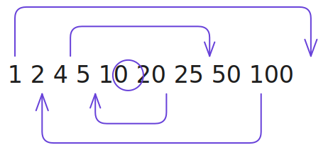

# Theory for Mathematics in DSA

## Why we need to learn Mathematics?

> Because its MATHS and it's everywhere 🧮

Having a solid foundation in specific mathematical concepts is crucial for understanding and optimizing algorithms.

> [!Info] Info
> Procedural languages like `Java`, `C++`, and `Python` for problem-solving require basic mathematical concepts, including functions, variables, and fundamental operations.

Moreover, **_Data Structures_** deal with the organization of data, while algorithms focus on procedures for manipulating that data -- both concepts rooted in mathematical principal.

Core mathematical topics you need for [DSA](https://www.geeksforgeeks.org/dsa/dsa-tutorial-learn-data-structures-and-algorithms/) include:

- **[Discrete Mathematics:](https://www.geeksforgeeks.org/engineering-mathematics/discrete-mathematics-tutorial/)** Sets, functions, relations, and basic proof techniques
- **[Number Theory:](https://codeforces.com/blog/entry/143150)** Concepts like GCD, LCM, prime numbers, and factorization
- **[Graph Theory:](https://www.youtube.com/watch?v=Qlr-26wRRt4)** Essential for networking, AI, and optimization problems
- **[Combinatorics:](https://codeforces.com/blog/entry/110376)** Used for counting problems and permutations
- [**Probability and Statistics:**](https://www.guvi.in/blog/probability-and-statistics-for-data-science/) Important for randomized algorithms

## Core Math's Topics for DSA

Given are some of the most core math's topics that will help us to understand how algorithms work and give us a push to design our own solution for problems.

### 1. GCD and HCF (Euclidean Algorithm)

> Watch this video for GCD according to me this one is the best to understand how to solve a GCD problem [William Y. Feng](https://youtu.be/YZfPcvbwwvI?si=iogzJRmhijgzOipk)

> Check this video for HCF and LCM [FlashMath](https://youtu.be/bOh6E17q87M?si=pKsz2pGvgySef26j).

The **Greatest Common Divisor** (GCD) or **Highest Common Factor** (HCF) is the largest positive integer that divides two numbers without a remainder. The Euclidean algorithm provides an efficient method to calculate GCD.

Instead of finding factors of both numbers, this algorithm uses a recursive approach based on the principle:
$$gcd(a, b) = gcd(b, a \\% b)$$
When $b \neq 0$, and $gcd(a, 0) = a$.

For Example:
$$gcd(48, 18) = gcd(18, 12) = gcd(12, 6) = gcd(6, 0) = 6$$
The time complexity is $O(log(min(a, b)))$, making it remarkably efficient even for large numbers.

> [!INFORMATION] Info
> `Java` has a in-built method to get $gcd$ of numbers which is `Math.gcd`
> Otherwise, one can implement it in two ways
>
> - Recursive Approach
> - Iterative Approach (Avoids `StackOverflowError`)

**Recursive approach**:

```java
public static int gcd(int a, int b) {
    if (b == 0) return a;
    return gcd(b, a % b);
}
```

**Iterative approach**:

```java
public static int gcd(int a, int b) {
    while (b != 0) {
        int temp = b;
        b = a % b;
        a = temp;
    }
    return a;
}
```

### 2. Prime Numbers and Sieve of Eratosthenes

> For More Detailed Article check this [cp-algorithms.com](https://cp-algorithms.com/algebra/sieve-of-eratosthenes.html)

**Key points**:

- **Prime Numbers 1-100:**
  ```decimals
  2, 3, 5, 7, 11, 13, 17, 19, 23, 29, 31, 37, 41, 43, 47, 53, 59, 61, 67, 71, 73, 79, 83, 89, 97.
  ```
- **Efficiency:** It is highly efficient for finding small primes, with a time complexity of $(O(n \log(\log n)))$.

The **_Sieve of Eratosthenes_** is a clever, ancient method which is still super useful for finding all the prime number within a given range $[1;n]$.

#### How it works

A super simple analogy to understand this algorithm is given below:

Imagine you have a list of all numbers from 2 to, let's say, 100. Now, your job is to **cross** out all the **composite** (non-prime) numbers and leave only the primes.

For this you follow the given steps:

1. You start with the first prime number : `2`
   - As now you got `2`, you **cross** out all the multiples of `2` : $[4, 6, 8, 10, 12, 14, ....]$ (all those multiples can never be prime since they are divisible by `2`)
1. Go to the next number that isn't **crossed out** yet which is `3`
   - Cross out all the multiples of `3` : $[6, 9, 12, 15,...]$ (but many of these will already be crossed on the first step (_which reduces the time to do the operation_).
1. Next unmarked number : `5`. Cross out all the multiples $[10, 15, 20, 25,...]$
1. Continue with the remaining unmarked/crossed numbers $[7, 11, 13, 17,...]$

**See this image:**


Whenever we reach a number that hasn't been crossed out, it must be prime **Because no smaller number than the current were able to divide it evenly**.

> We keep on going until we've processed numbers up to $\sqrt{n}$ .
> You can check [this article on why we don't use](https://math.stackexchange.com/questions/1343171/why-only-square-root-approach-to-check-number-is-prime) $cube$ and $4^{th}$ root

##### Why only till the $\sqrt{n}$ and not till $n$ ?

> [!IMPORTANT] Basic Example
> For a number to be prime you need it to have a factor other than itself or one. Factors come in pairs to multiply to the number. Take 36 its factors are 1 36, 2 18, 3 12, 4 9, 6 6.
> If you find these out from smallest with their pairs then once you reach 6 (the square root) you know all possible factors. This is because if 6×6=36 then you can't get two numbers higher like 7 and 8 to multiply together to get 36.

> Therefore to check for, let's say 27 is prime you only need to check if up to 5 is divisible. A larger number like 6 (6 will pair with 6 only with respect to give 36) would need to pair with one of them so we don't need to check it if all possible pairs have be ruled out.

###### Example:

Let's say we have a number $n$ with a value of $100$ i.e. $n=100$.
Now, we need to find all the factors for 100 from 1 to 100.

###### Step 1: Factors always come in pairs

Any number n can be written as: $$a\ ×\ b = n$$
which are, $1,2,4,5,10,20,25,50,100$
For **n = 100**, the factor pairs are:

1. **1 × 100** = {1, 100}
2. **2 × 50** = {2, 50}
3. **4 × 25** = {4, 25}
4. **5 × 20** = {5, 20}
5. **10 × 10** = {10, 10}

Notice the pattern:

- Every factor **smaller than or equal to 10** ($\sqrt{100} = 10$) has a matching partner **greater than or equal to 10**.
- Once we cross $\sqrt{n}$, we start repeating the same factors in **reverse**.
  **_Visual Idea:_**



**How this helps in the Sieve:**
We only need to mark multiples of numbers up to $\sqrt{n}$.
In our example:

- We only run the outer loop for numbers 2, 3, 5, 7 (all $≤10$).
- These 4 small numbers are enough to mark all **composite numbers** up to 100.

> [!abstract] WHY?
> Because any composite number bigger than 10 must have at least one factor ≤10. If it doesn't, then it is prime.

**Let’s check with number 67:**

- $\sqrt{100}$ = 10, so we only check divisibility by primes ≤ 10 → **2, 3, 5, 7**.
- 67 ÷ 2 = 33.5 → not divisible
- 67 ÷ 3 ≈ 22.333 → not divisible
- 67 ÷ 5 = 13.4 → not divisible
- 67 ÷ 7 ≈ 9.57 → not divisible
  Since no prime ≤ $\sqrt{100}$ divides 67, **67 is prime**.

###### Mathematical Formula

To determine if \(n\) is prime, you test for a divisor \(d\) such that:
$$2\le d\le \sqrt{n}$$

**The Logic:**
If $(n = a \times b)$, then:
$$\min (a,b)\le \sqrt{n}$$
**The Algorithm Condition:**  
$$\forall d\in \mathbb{Z}:2\le d\le \sqrt{n}\implies n\mathinner{\;\left(\mod \,d\right)}\ne 0$$

#### Code Implementation

In $C++$ we would use something like this

```cpp
// imports
vector<bool> sieve(int n) {
    vector<bool> is_prime(n+1, true);
    is_prime[0] = is_prime[1] = false;

    for (int i = 2; i * i <= n; i++) {
        if (is_prime[i]) {
            for (int j = i * i; j <= n; j += i) {
                is_prime[j] = false;
            }
        }
    }
    return is_prime;
}

// main() function ...
```

> For `JAVA`

```java
// imports
public class Sieve {
    public static boolean[] sieve(int n) {
        boolean[] is_prime = new boolean[n + 1];
        Arrays.fill(is_prime, true);
        is_prime[0] = is_prime[1] = false;

        for (int i = 2; i * i <= n; i++) {
            if (is_prime[i]) {
                for (int j = i * i; j <= n; j += i) {
                    is_prime[j] = false;
                }
            }
        }
        return is_prime;
    }
// main method
}
```

`Python`:

```python
def sieve(n):
    is_prime = [True] * (n + 1)
    is_prime[0] = is_prime[1] = False

    for i in range(2, int(n**0.5) + 1):
        if is_prime[i]:
            for j in range(i*i, n+1, i):
                is_prime[j] = False

    return [i for i in range(2, n+1) if is_prime[i]]
```

> [!IMPORTANT] Time & Memory
>
> - It runs very fast: roughly $O(n \log (\log n))$ — excellent in practice.
> - Basic version uses about $n$ bits of memory (can be optimized further).

##### Real-life Uses

- Generating primes for competitive programming problems.
- Cryptography (big primes are important).
- Any time you need to check primality for many numbers quickly.

### 3. Square Root using Binary Search

> Finding a square root can be efficiently done using binary search.

Since the square root of a number must lie between 0 and the number itself, we can apply binary search in this range.

This approach works because

- if $mid^{2} > n$ , the square root must be smaller, &
- if $mid^{2} ≤n$, the square root could be that number or greater.

The **Time complexity** is $O(log\ n)$, & **Space complexity** is $O(1)$ making it suitable for large numbers.

**Code Implementation:**

```java
class Solution {
    // This function returns the floor value of the square root of a number
    public int mySqrt(int x) {
        // Handle small numbers directly
        if (x < 2) return x;
        // Initialize binary search range
        int left = 1, right = x / 2, ans = 0;
        // Perform binary search
        while (left <= right) {
            // Find middle point
            long mid = left + (right - left) / 2;
            // Check if mid*mid is less than or equal to x
            if (mid * mid <= x) {
                // Store mid as potential answer
                ans = (int) mid;
                // Move to right half
                left = (int) mid + 1;
            } else {
                // Move to left half
                right = (int) mid - 1;
            }
        }
        // Return final answer
        return ans;
    }
}

public class Main {
    public static void main(String[] args) {
        Solution s = new Solution();
        System.out.println(s.mySqrt(8));
    }
}
```

### 4. Divisors and Factorization

A divisor of a number divides it evenly without leaving a remainder. Finding all divisors efficiently requires understanding that they come in pairs.

For example: To find divisors of n:

- Iterate from 1 to $\sqrt{n}$
- If $n$ is divisible by $i$, both $i$ and $\frac{n}{i}$ are divisors
  This approach reduces time complexity from $O(n)$ to $O(\sqrt{n})$.

### 5. Modular Arithmetic and Inverse

[Check cp-algorithms for more detailed breakdown](https://cp-algorithms.com/algebra/module-inverse.html)

Modular arithmetic deals with remainders after division. Its importance in DSA stems from handling large numbers and preventing overflow.

Key properties:

- $(a + b)\ mod\ m = ((a\ mod\ m)\ + (b\ mod\ m))\ mod\ m$
- $(a \times b)\ mod\ m\ = ((a\ mod\ m)\ \times (b\ mod\ m))\ mod\ m$

A modular multiplicative inverse of a number `a` is another number `x` such that $(a \times x)\ ≡ 1\ (mod\ m)$. This inverse exists only when a and m are coprime, meaning their GCD is 1.

### 6. Fast Power (Exponential by Squaring)

Computing large exponents efficiently is crucial in cryptography and many algorithms. Exponentiation by squaring divides the work using the binary representation of the exponent

**The key insight**: $x^{n}$ can be calculated as:

- $x\times(x^{2})^{((n-1)/2)}$ → if `n` is odd
- $(x²)^{(n/2)}$ → if `n` is even

This reduces complexity from $O(n)$ to $O(log\, n)$

### **7. Fibonacci and Factorial**

Fibonacci sequence (0,1,1,2,3,5,8…) is where each number is the sum of the previous two. The factorial of n (n!) is the product of all positive integers less than or equal to n.

Both concepts demonstrate:

- Recursive definitions
- Dynamic programming applications
- Various time complexity optimizations

### **8. Euler’s Totient Function**

Euler’s totient function φ(n) counts positive integers up to n that are coprime to n. For example, $φ(9)$=6 as 1,2,4,5,7,8 are all relatively prime to 9.

For a prime number p, $φ(p)$ =p-1. For two coprime numbers m and n, $φ(m×n)$ =φ(m)×φ(n). This function is crucial in number theory and cryptography applications like RSA.

## Advanced Math Concept (For Later Learning)

### **1) Chinese Remainder Theorem**

This theorem helps solve systems of congruence equations efficiently. When given several divisors and remainders, it finds the unique solution modulo the product of coprime moduli. Its applications include:

- Handling large numbers in cryptography
- Solving modular equations in number theory
- Implementation with O(1) time complexity for lookups

> Check [cp-algorithms](https://cp-algorithms.com/algebra/chinese-remainder-theorem.html)

### **2) Catalan Numbers**

This sequence (1, 1, 2, 5, 14, 42…) appears throughout combinatorial mathematics. Catalan numbers count:

- Correctly parenthesized expressions
- Different binary tree arrangements
- Triangulations of polygons
- Non-crossing partitions

> Check [cp-algorithms](https://cp-algorithms.com/combinatorics/catalan-numbers.html)

### **3) Discrete mathematics for DSA**

Discrete math forms the backbone of computer science. Key areas include:

- Set theory and logic for algorithm correctness
- Graph theory for tree structures and network algorithms
- Functions and recursion for algorithm design
- Asymptotic analysis for evaluating efficiency

> Check [GFG](https://www.geeksforgeeks.org/engineering-mathematics/discrete-mathematics-tutorial/)

### **4) Probability and combinatorics in algorithms**

These fields are essential for analyzing algorithm performance. They’re particularly important for:

- Randomized algorithms analysis
- Average-case complexity evaluation
- Machine learning algorithm development
- Counting problems in computational solutions

> Check on [freedium-mirror (medium article but for free)](https://freedium-mirror.cfd/https://medium.com/intuitively-and-exhaustively-explained/combinatorics-in-probability-intuitively-and-exhaustively-explained-bd41df6af719)
>
> Archived link if in case the above won't work [web.archive.org](https://web.archive.org/web/20260508025238/https://freedium-mirror.cfd/https://medium.com/intuitively-and-exhaustively-explained/combinatorics-in-probability-intuitively-and-exhaustively-explained-bd41df6af719)
