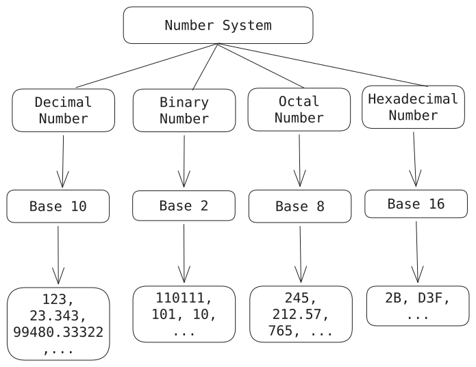

## Number System Basics

### Count Digits

If we need to find the _count of digits_ in a number we can do that by given two methods

#### 1. Using $\log_{10}(n)$

We can count digits in a number by making use of $\log_{10}(n)$ as the `log` with `base 10` gives an approximate value of the digits in a number.
For example:

- $\log_{10}(1234)$ = 3.0913151597
  So, if we add one in here it becomes 4 in terms of `int`. which is the size of the given input.
- $\log_{10}(5554422554)$ = 9.74463891573
  Here also, if we add one then we get the count of digits.

Same for every other number.
This operation takes a constant time so the Time complexity taken by this approach is in constant, which is the best out there.

**Code Implementation**

```java
public class DigitManipulationDemo{
	public void findDigitsUsingFormula(int num){
	    int res = (int) Math.log10(num) + 1;
		System.out.println("Number of digits in given num is: " + res);
	}

	public static void main(String[] args){
		DigitManipulationDemo dm = new DigitManipulationDemo();
		dm.findDigitsUsingFormula(1234); // output 4
	}
}
```

Output : `Number of digits in given num is: 4`

But what about conditions where the number is a negative (-1234) or zero (0) as to say simply $log_{10}\,(-n)$ is `undefined` and $log_{10}(0)$ is also `undefined`.

So we can solve this cases with:

1. Digit count in a number will be same if the number is negative or positive so if we made negative number to positive one by multiplying the negative number by minus one $(-1)$ we'll get our positive number
   Example: $(-1234) \times (-1)$ = 1234
2. If a number is zero (0) we can simply put a condition in the code so that it'll always return count 1 if the given number is 0.

**Updated Class Code**

```java
public class DigitManipulationDemo{
	public void findDigitsUsingFormula(int num){
	    if(num == 0){
	        System.out.println("Number of digits: " + 1);
            return;
	    }
	    if(num < 0){
	        num *= -1;
	    }
	    int res = (int) Math.log10(num) + 1;
		System.out.println("Number of digits in given num is: " + res);
	}

	public static void main(String[] args){
		DigitManipulationDemo dm = new DigitManipulationDemo();
		dm.findDigitsUsingFormula(-1234); // output 4
		dm.findDigitsUsingFormula(0);
		dm.findDigitsUsingFormula(4433221);
	}
}
```

> The `return;` keyword helps the method to close itself there and go back to the main method without looking at the below code. (If we do not use `return;` in there we'll get the least `int` number after the second output.)

```output
Number of digits in given num is: 4
Number of digits: 1
Number of digits in given num is: 7
```

#### 2. Using Division

Another method is the `Division` method in which we can check the last digit of the number then remove it and continue the same process till the first digit is counted.

In simpler terms what we do here is:

1. Create a variable to store the count
2. Create a `while` (will run till the condition is true), Inside while loop:
   - Divide the number by 10 ($\frac {1234} {10}$ = 123.4. but in `int` only the decimals before the point will be considered so `123`)
   - increment the count by 1.
3. Above process will repeat itself till the number is greater than 0.
4. Once the loop is stopped we get the count of digits of given number.

**Code:**

```java
public class DigitManipulationDemo{
	public void findDigitsUsingDivision(int num){
	    if(num == 0){
	        System.out.println("Count: " + 1);
	        return;
	    }
	    if(num < 0) num *= -1;
	    int res = 0;
	    while(num > 0){
	        num /= 10;
	        res++;
	    }
	    System.out.println("Count: " + res);
	}

	public static void main(String[] args){
		DigitManipulationDemo dm = new DigitManipulationDemo();
		dm.findDigitsUsingDivision(1234); // output 4
		dm.findDigitsUsingDivision(0);
		dm.findDigitsUsingDivision(-4433221);
	}
}
```

Output:

```output
Count: 4
Count: 1
Count: 7
```

### Appending Digits

#### Append at Last

To append a digit at the end of a number we can simply follow the multiplication rule,
If we multiply any number with 10 it leaves 0 at the end and on that zero (0) we can add our digit and then return the new updated number in which the digit will be the last one
which means we have appended the digit at the end of the number.

> But for case like negative number we need to add a `checker` which will check if the number is negative and if it is negative then hold that information onto a variable and just before printing the result change the sign of the positive value which we will be doing before the operation.

Meaning,

1. Create a `boolean` (checker) to check if the num is negative
2. If the number is negative
   - Change the `boolean` to be `true`, and make it positive (multiply by $(-1)$)
3. Check if the number is negative using the checker give it the negative sign back (multiply by $(-1)$).
4. return/print the result.

> For more than one count of digit (like $14, 150, 23450$) we can make use of our previous digit count system of $log_{10}(n) + 1$ which will give us the count of digits in the `digit` variable and we can then multiply the `num` with that many zeros (10...) and add the `digit` (This is going to be handy on the next topic).

**Code**

```java
public void appendDigit(int num, int digit){
    boolean isNeg = false;
    if(num < 0){
        isNeg = true;
        num *= -1;
    }
    int res = num * 10 + digit;
    if(isNeg) res = -1 * res;
    System.out.println("New number is: " + res);
}
```

**Test Case:** `num = -1234`, `digit = 5`.
**Output:** `New number is: -12345`

What about the test cases starting with zero (0) ??
Example: $01,05,07,etc..$
For that case it'll be a lot easier as we can use the String properties and we'll need to use String prop.  
Because it (_leading zero_) turns it into an [octal](https://en.wikipedia.org/wiki/Octal) literal, rather than decimal. That's not to say you shouldn't use it, but don't use it where you are trying to write a decimal number.

#### 4. Insert at Front

Similar to what we did above,
If we want to insert number/digits at the front of a number we need to have that much zeros at the end of the number as then we want to add our original number with the digits one, we can show it as given

- Create a variable (checker -- false when initialize) to check if the number is negative or positive
- if given num is negative
  - change it to positive
  - make the variable (checker) true
- Count digits in the digit (number to be added to the front) using the $log_{10}$ + 1 formula
- Calculate the `result` by multiplying the digit (count) by 10 with the power of the count/number of digits in the digit.
- If the checker is true (i.e. number is negative)
  - make it positive
  - print the result

```java
public void insertAtFront(int num, int digit){
    // checker
    boolean isNeg = false;
    if(num < 0){
        num *= -1;
        isNeg = true;
    }
    // log base 10 formula to count the digits in num
    int digits = (int) Math.log10(num) + 1;
    int res = digit * (int) Math.pow(10, digits) + num;
    if(isNeg) res *= -1;
    System.out.println("New number is: " + res);
}
```

**Output**:
Test Case : `num : -1234` , `digit: 5`
Result : `-51234`.

---

#### 5. Reverse a Number

To reverse a number we simply need to perform few operation while the num is greater than zero (0).

- Create a variable to store result
- While num > 0
  - get the last digit of the num (use $\%10$)
  - append the digit to the res (by multiplying it with 10 so that the next digit will always be after the previous one)
  - remove the last digit from original num

```java
public void reverseNumber(int num) {
    int res = 0;
    System.out.println("Original Number: " + num);
    while (num > 0) {
        int digit = num % 10;
        res = res * 10 + digit;
        num /= 10;
    }
    System.out.println("Reversed Number: " + res);
}
```

> [!Important] Important
> For **Negative Number** simply create a checker (_boolean_) and make it positive before reversing and after reversing the num make it negative.
> And **_ZERO_** will simply be zero after reversing.

**Output**
Test Case : `num : 12345`
Expected Output : `54321`

```output
Original Number: 12345
Reversed Number: 54321
```

Time Complexity: $O(log_{10} n)$
Space Complexity : $O(1)$

---

#### 6. Even or Odd

> Check if the number is completely divisible by 2 (i.e. $num \% 2$ should give $0$)

```java
public void evenOrOdd(int num) {
    if (num % 2 == 0)
        System.out.println("Given num is Even!");
    else
        System.out.println("Given num is Odd!");
}
```

**Output:**
Test Case: `1234`
Output : `Given num is Even`

---

### Exponentials

#### 1. Power of a num

To get a power of a num we need to multiply the num that number of times.
Example: $2^{4}$ = $2 \times 2 \times 2 \times 2$ = $16$.

And for negative values we need to make it to denominator to make it positive
_Example:_ $a^{-n} = \frac{1}{a^n} \,where \,a \neq 0$
_Example:_ $x^{-5} = \frac{1}{x^5}$

> We can easily use the built-in method `Maths.pow(num, power)` to the power of a number
> like this :
>
> ```java
> System.out.println(Math.pow(2, -1));
> ```

```java
public void findPower(int num, int power){
    boolean isNeg = false;
    if(power < 0){
        power *= -1;
        isNeg = true;
    }
    double res = 1;
    for(int i = 0; i < power; i++){
        res *= num;
    }
    if(isNeg) res = 1/ res;
    System.out.printf("The result of given power expression is: %.2f", res);
}
```

> Used `%.2f` to only print two decimals after the point.

**Output:** `The result of given power expression is: 0.50`

#### 2. Fast Exponentiation

- **Method:** Instead of multiplying $a, n$ times $(a \times a \times \dots \times a)$, the algorithm uses the structure of the exponent.
- **Recursive Structure:**
  - If $(n)$ is even: $a^n = (a^{n/2})^2$
  - If $(n)$ is odd: $a^n = a \times (a^{n/2})^2$
- **Time Complexity:** Reduces the operations from linear $O(n)$ to logarithmic $O(log \,n)$.

**Example (Binary Exponentiation)**
To calculate $3^{10}$:

1. $3^{10} = (3^2)^5 = 9^5$
2. $9^5 = 9 \times (9^2)^2 = 9 \times 81^2$
3. $81^2 = 6561$
4. $9 \times 6561 = 59049$

```java
public void fastExponentiation(int base, int power){
    boolean isNeg = false;
    if(power < 0){
        isNeg = true;
        power *= -1;
    }
    double res = 1;
    while(power > 0){
        if(power % 2 != 0){
            res *= base;
            power--;
        }
        base *= base;
        power /= 2;
    }
    if(isNeg) res = 1/res;
    System.out.println("Result: " + res);
}
```

---

## Number System

> It is a method of representing numbers with the help of a set of symbols and rules; it is a mathematical notation used to represent quantities or values in various forms.

- _Humans understand **decimal** (0,1,2,3,4,5,6,7,8,9), and computers understand **binary** (0 {false},1 {true}), so we have two different number systems._
- Binary can be **long** for _large amount_ of data, so there are more systems like **octal** and **Hexadecimal** that allow binary sequence to be broken into groups making it less **error-prone** and readable compared to binary.

> [!IMPORTANT] Imp.
> Everything is treated as **_binary_** inside a computer/processor.

Number system provide a structured way to represent numbers, which enables arithmetic operations and ensuring consistent, understandable notation



#### 1. Decimal Number System

- It is also called the ***base-10*** system.
- Digits used in it are ***0, 1, 2, 3, 4, 5, 6, 7, 8, 9.***

**Example:**

> _10285 can be written as_  
> _10285 = (1 × 10⁴) + (0 × 10³) + (2 × 10²) + (8 × 10¹) + (5 × 10⁰)_  
> _10285 = 1 × 10000 + 0 × 1000 + 2 × 100 + 8 × 10+ 5 × 1_  
> _10285 = 10000 + 0 + 200 + 80 + 5_  
> _10285 = 10285_

#### 2. Binary Number System

[Binary Number System](https://www.mathsisfun.com/binary-number-system.html) is the number system with \***\*base 2\*\***.

- The numbers are formed using two digits - \***\*0 and 1.\*\***
- Binary number system is very useful in electronic devices and computer systems because it can be easily performed using just two state i.e. 0 and 1. 
- Each digit in the number is at a specific place value that is powers of 2.
- From right to left - as powers of 2 i.e. 20, 21, 22, etc).

**_Example:_**

> _(1011)₂ can be written as_  
> _(1011)₂ = 1 × 2³ + 0 × 2² + 1 × 2¹ + 1 × 2⁰_  
> _(1011)₂ = 1 × 8 + 0 × 4 + 1 × 2 + 1 × 1_  
> _(1011)₂ = 11 (in decimal)_

<p style="text-align:center; border: 2px solid; padding: 2px;">"There are <b>10</b> kinds of people in the world, <br> 
those who understand <i>binary numbers, and those who don't.</i>" </p>

#### 3. Octal Number System

[Octal Number System](https://www.geeksforgeeks.org/maths/octal-number-system/) is the number system with ***base 8***.

- The numbers are formed using 8 digits i.e. ***0, 1, 2, 3, 4, 5, 6, 7.***
- Octal number system is useful for representing file permissions in Unix/Linux operating systems.
- Each digit in the number is at a specific place value that is powers of 8.
- From right to left - as powers of 8 i.e. 80, 81, 82, etc.

Octal Numbers can be converted to Decimal value by multiplying each digit with the place value and then adding the result.

***Example:*** 

> $(325)_8$ can be written as
> $(325)_8$ = 3 × 8² + 2 × 8¹ + 5 × 8⁰
> $(325)_8$ = 192 + 16 + 5
> $(325)_8$ = 213 (in decimal)

#### 4. Hexadecimal Number System

A [Hexadecimal number](https://www.mathsisfun.com/hexadecimals.html) is based on the number _16_.

- The numbers are formed using 16 digits i.e. ***0, 1, 2, 3, 4, 5, 6, 7, 8, 9, A, B, C, D, E and F.***
- Hexadecimal Numbers are useful for handling memory address locations. 
- The digits from ***0 to 9*** are used as in the decimal system, but the numbers ***10 to 15*** are represented using the letters ***A to F*** as follows: 10 is represented as ***A***, 11 as ***B***, 12 as ***C***, 13 as ***D***, 14 as ***E***, 15 as ***F.***

## Converting Number Systems

There are ways through which we can convert

- any base to decimal
- any decimal to base
- any decimal to octal
- any decimal to hex
- and so on...

But we'll mainly look for two approach

1. Any Number System to Decimal
2. Decimal to Any Number System
   Which can leads us any of what we want in the number system.

> If you want to learn how to convert each and everything [check this out!](https://medium.com/@_majidkhan/number-system-conversions-f6a9b1d4cb17)

#### 1. Any Number System to Decimal

**Below is the Code:**

```java
public class NumberSystem {
    public static void main(String[] args) {
        NumberSystem ns = new NumberSystem();
        ns.convertToDecimal("4B", 16);
    }

    private int getDigit(char ch) {
        return switch (ch) {
            case 'A' -> 10;
            case 'B' -> 11;
            case 'C' -> 12;
            case 'D' -> 13;
            case 'E' -> 14;
            case 'F' -> 15;
            default -> ch - '0';
        };
    }

    public void convertToDecimal(String input, int currentBase) {
        int res = 0;
        int pos = 0;
        int len = input.length();
        for (int i = len - 1; i >= 0; i--) {
            int digit = getDigit(input.charAt(i));
            // base checker
            if (digit >= currentBase || digit < 0) {
                System.out.println(
                        "Invalid number '" + input +
                                "' for base " + currentBase
                );
                return;
            }

            res = res + digit * (int) Math.pow(currentBase, pos);
            pos++;
        }
        System.out.println("Converted number is: " + res);
    }
}
```

**Output:**

```java
NumberSystem ns = new NumberSystem();
ns.convertToDecimal("7B", 16);
```

> `Converted number is: 123`

#### 2. Decimal to Any Number System

```java
public void convertFromDecimal(int input, int destinationBase){
    StringBuilder res = new StringBuilder();
    // while the input is greater than 0
    while(input > 0){
        int r = input % destinationBase; // get the result after modulo.
        char ch = getChar(r); // get the related char from Value
        res.append(ch);   // append to the result
        input /= destinationBase;   // divide the input by base
    }
    System.out.println("Converted Number is: " + res.reverse()); // return the string in reverse as result
}

// Getchar method
private char getChar(int r){
    return switch (r){
        case 10 -> 'A';
        case 11 -> 'B';
        case 12 -> 'C';
        case 13 -> 'D';
        case 14 -> 'E';
        case 15 -> 'F';
        default -> (char) (r + '0');
    };
}
```

**Output:**

```java
ns.convertFromDecimal(123, 10);
```

> `Converted Number is: 7B`

---

## Interview & Concept Review

Here are key interview-style questions and problems related to number systems, digit manipulations, and exponentiation.

#### 1. Digit Counting, Edge Cases, and the `Integer.MIN_VALUE` Trap

**Question:** While the formula $\lfloor \log_{10}(x) \rfloor + 1$ is an $O(1)$ method to count digits in a base-10 number, what are its mathematical limitations? Specifically, explain what happens in Java when `x = 0`, `x < 0`, and when `x = Integer.MIN_VALUE` ($-2147483648$). How do you write a foolproof solution?

**Answer:**

1. **The Case of $x = 0$:** $\log_{10}(0)$ is mathematically undefined ($-\infty$). Attempting to calculate `Math.log10(0)` in Java returns `Double.NEGATIVE_INFINITY`, which casts to `0` or results in incorrect logic.
2. **The Case of $x < 0$:** $\log_{10}$ is undefined for negative values.
3. **The `Integer.MIN_VALUE` Trap:** A common way to handle negative inputs is:
   ```java
   if (num < 0) num = -num;
   ```
   However, for a 32-bit signed integer, `Integer.MIN_VALUE` is $-2147483648$, while `Integer.MAX_VALUE` is $2147483647$. Since the absolute value of the minimum integer cannot be represented in a positive 32-bit signed integer, negating `Integer.MIN_VALUE` results in overflow and remains negative ($-2147483648$)! This causes `Math.log10(num)` to fail.

**Foolproof Solution:**
We can cast to `long` before negating, or check for these boundary conditions explicitly:

```java
public class DigitCounter {
    public static int countDigits(int num) {
        if (num == 0) return 1;
        // Handle Integer.MIN_VALUE explicitly, or convert to long
        long val = Math.abs((long) num);
        return (int) Math.log10(val) + 1;
    }
}
```

---

#### 2. Reverse an Integer with Overflow Check (Tricky Coding Question)

**Question:** Given a 32-bit signed integer $x$, return $x$ with its digits reversed. If reversing $x$ causes the value to overflow the signed 32-bit range $[-2^{31}, 2^{31} - 1]$, return $0$. Do not use a 64-bit storage type like `long` (simulating a 32-bit system).

**Answer:**
We can reverse the number digit-by-digit. To avoid overflow, we must inspect the reversed variable _before_ multiplying it by $10$ and adding the next digit.

- Let `Integer.MAX_VALUE = 2147483647` (ends in 7). If `res > 214748364` or (`res == 214748364` and `digit > 7`), overflow will occur.
- Let `Integer.MIN_VALUE = -2147483648` (ends in -8). If `res < -214748364` or (`res == -214748364` and `digit < -8`), underflow will occur.

_Note: In Java, modulo on negative numbers preserves the sign (e.g., `-123 % 10 = -3`), which simplifies our code._

```java
public class ReverseInteger {
    public static int reverse(int x) {
        int res = 0;
        while (x != 0) {
            int digit = x % 10;

            // Check overflow before modifying res
            if (res > Integer.MAX_VALUE / 10 || (res == Integer.MAX_VALUE / 10 && digit > 7)) {
                return 0;
            }
            if (res < Integer.MIN_VALUE / 10 || (res == Integer.MIN_VALUE / 10 && digit < -8)) {
                return 0;
            }

            res = res * 10 + digit;
            x /= 10;
        }
        return res;
    }

    public static void main(String[] args) {
        System.out.println(reverse(123));          // Output: 321
        System.out.println(reverse(-123));         // Output: -321
        System.out.println(reverse(1534236469));   // Output: 0 (overflows)
    }
}
```

- **Time Complexity:** $O(\log_{10}(x))$ — one iteration per digit.
- **Space Complexity:** $O(1)$.

---

#### 3. Fast Exponentiation with Negative/Overflown Exponents

**Question:** Write a robust fast exponentiation method that calculates $x^n$ where $n$ can be positive, negative, or **_Integer.MIN_VALUE_**.

**Answer:**
To handle negative exponents, we use $x^{-n} = (1/x)^n$. To prevent overflow when **`n = Integer.MIN_VALUE`** (since $-(-2147483648)$ overflows a 32-bit signed integer), we convert $n$ to a 64-bit `long` exponent.

```java
public class RobustPower {
    public static double myPow(double x, int n) {
        long N = n;
        if (N < 0) {
            x = 1 / x;
            N = -N;
        }

        double res = 1;
        double currentProduct = x;
        while (N > 0) {
            if ((N % 2) == 1) {
                res = res * currentProduct;
            }
            currentProduct = currentProduct * currentProduct;
            N /= 2;
        }
        return res;
    }

    public static void main(String[] args) {
        System.out.println(myPow(2.0, 10));                       // 1024.0
        System.out.println(myPow(2.0, -2));                       // 0.25
        System.out.println(myPow(1.0000000000001, Integer.MIN_VALUE)); // Robustly handles MIN_VALUE
    }
}
```

- **Time Complexity:** $O(\log n)$
- **Space Complexity:** $O(1)$

---

#### 4. Base-62 Conversion for System Design (Tricky Coding Question)

**Question:** In system design (e.g., building a URL shortener like TinyURL), database IDs are mapped to short strings using Base-62 encoding (which uses `0-9`, `a-z`, and `A-Z`). Write a Java program to convert a `long` ID into its Base-62 string representation.

**Answer:**
Base-62 uses $62$ unique alphanumeric characters. The mapping can be set as:

- `0-9` maps to indices `0-9`
- `a-z` maps to indices `10-35`
- `A-Z` maps to indices `36-61`

We divide the ID by $62$ repeatedly and append the corresponding character of the remainder to a string, which we reverse at the end.

```java
public class Base62Encoder {
    private static final String CHARACTERS = "0123456789abcdefghijklmnopqrstuvwxyzABCDEFGHIJKLMNOPQRSTUVWXYZ";

    public static String encode(long id) {
        if (id == 0) return "0";

        StringBuilder sb = new StringBuilder();
        while (id > 0) {
            int remainder = (int) (id % 62);
            sb.append(CHARACTERS.charAt(remainder));
            id /= 62;
        }
        return sb.reverse().toString();
    }

    public static void main(String[] args) {
        long dbId = 125L;
        System.out.println("Base-62 string of " + dbId + " is: " + encode(dbId));
        // Output: "cb" (since 62 * 2 + 1 = 124 + 1 -> 'c' (index 12) & 'b' (index 11) reversed)
    }
}
```

- **Time Complexity:** $O(\log_{62}(id))$
- **Space Complexity:** $O(\log_{62}(id))$ to store the output string.
