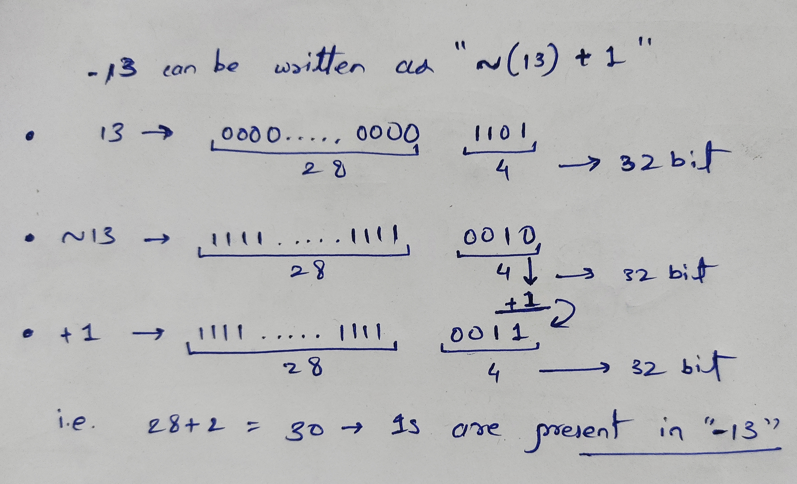

## Bit Manipulation Tricks

> [!abstract] These techniques appear repeatedly in coding interviews.

### 1. Check if a Bit is Set

To check if the `k-th` bit (0-indexed from right) is set to 1:

> [!abstract] What the Question says:
> We need to find if the $k^{th}$ bit of the given binary number is a set (`1`) bit or not !!
> **Example:**
> `13 → 1101  // and k = 2`
> So, we have to check if the second element from the right of the given number (13 $\rightarrow$ 1101) is `1` if yes then return true.

**How to do it:**
By just doing an `AND (&)` operation with `1` we can know that the given bit is a set bit as `1 & 1 = 1` and all other operations leave `0`, and to get the $1$ at $k^{th}$ bit we can make use of `Left Shift` operator.

```
(1 << k) & num) != 0;
```

**Method:**

```java
private boolean checkSetBit(int num, int k){
	return ((1 << k) & num) != 0;
}
```

**Example Code:**

```java
public class CheckSetBitDemo {
    private boolean CheckSetBit(int num, int k){
        return ((1 << k) & num) != 0;
    }

    void main() {
        int k = 2;
        int num = 13;
        CheckSetBitDemo cb = new CheckSetBitDemo();
        if (cb.CheckSetBit(num, k)) System.out.println("k^th bit of num: " + num + " is a set bit, k = " + k);
        else System.out.println("k^th bit of num: " + num + " is not a set bit");
    }
}
```

```Output
k^th bit of num: 13 is a set bit, k = 2
```

> Time Complexity `Constant` $\rightarrow$ $O(1)$

### 2. Set a Bit

To set the $k^{th}$ bit to 1:
**Method:**

```java
private int setBit(int num, int k){
	return num | (1 << k);
}
```

**What we are doing:**

- `Left Shifting` `1` to the index (`k`) where we need to add the Set bit.
- Adding the `Shifted value` to our original number using `OR (|)` operation
- Returning the resulted number as `int`.

**Example Code:**

```java
public class SetBitDemo {
    private int setBit(int num, int k){
        return num | (1 << k);
    }

    void main(){
        int num = 16;
        int k = 2;
        int result = setBit(num, k);
        System.out.println("Number before adding a set bit: "
                + num
                + "\nNumber after adding a set bit: "
                + result
        );
    }
}
```

```Output
Number before adding a set bit: 16
Number after adding a set bit: 20
```

> Time Complexity `Constant` $\rightarrow$ $O(1)$

### 3. Unset a Bit

The best way to unset a bit is to use `AND (&)` operation on it as `1 & 1 = 0`

**Method:**

```java
private int unsetBit(int num, int k){
	return (~(1 << k) & num);
}
```

**What we are doing:**

- `Left Shifting` $1$ to `k` indexes.
- **Flipping** all the bits from above binary number.
- Doing `AND (&)` operation on the number we get from second step with `num`.
- Returning the result as `int`.

**Example:**

```example
// num = 13, k = 2
13     → 1101
1      → 0001
1 << 2 → 0100
~(1 << 2) → ~(0100) → 1011

// and (&) operation
	1101
&   1011
----------
	1001 → 9 (in decimal)
```

Thus `13` changed into `9` after unsetting `2^nd` bit.

**Example Code:**

```java
public class UnsetBitDemo {
    private int unsetBit(int num, int k){
        return (~(1 << k) & num);
    }

    void main(){
        int num = 13, k = 2;
        int res = unsetBit(num, k);
        System.out.println("Num before unsetting k^th bit: " + num);
        System.out.println("Num after unsetting k^th bit: " + res);
    }
}
```

**Output:**

```Output
Num before unsetting k^th bit: 13
Num after unsetting k^th bit: 9
```

> Time Complexity `Constant` $\rightarrow$ $O(1)$

### 4. Toggle bit (flip bits)

Toggling a bit is simply flipping it `0 -> 1` and `1 -> 0`.

> [!NOTE] Cannot use `~`
> We can't use `NOT (~)` in here as it will flip all the bits in the given number

So if we cannot use `AND, OR, NOT` then theres remain only one thing to use `XOR (^)`

```
1 ^ 1 = 0
1 ^ 0 = 1
0 ^ 0 = 0
```

`XOR` returns `0` when both the digits are same and thus this can be used to identify an unique element in an array $\rightarrow$ by `XORing` every element we will at the end get the unique one.

Thus we can use this method
**Method:**

```java
private int toggleBit(int num, int k){
	return ((1 << k) ^ num);
}
```

**What is happening:**

- `Left Shift` $1$ by `k` digits
- `XOR` the result from above with num
- Return the result.

**Example:**

```example
// num = 13, k = 1
13     → 1101
1 << 1 → 0010

// XOR
	1101
^   0010
----------
	1111   → (15 in decimal)
```

Thus `13` got changed into `15` by toggling `k=1` bit.

**Example Code:**

```java
public class ToggleBitDemo {
    private int toggleBit(int num, int k){
        return ((1 << k) ^ num);
    }

    void main(){
        int num = 13, k = 1, res = toggleBit(num, k);
        System.out.println("Original Num: " + num);
        System.out.println("Resulted Num: " + res);
    }
}
```

**Output:**

```output
Original Num: 13
Resulted Num: 15
```

### 5. Count Set Bit (Brian Kernighan's Algorithm)

We've to count how many set bits `(1)` are present in the given number.

We can use `n & (n - 1)` formula here

```Example
// Suppose we have -> num = 13; now how to count set bits?

13 → 1101
// if we used "n & (n - 1)" until "num != 0" we can get the count of set bits

1. n = 13 (1101), n - 1 = 12 (1100)
	   1101
   &   1100
   ----------
	   1100

2. n = 1100 (12), n - 1 = 11 (1011)
	   1100
	&  1011
	----------
	   1000

3. n = 1000 (8), n - 1 = 7 (0111)
	   1000
	&  0111
	----------
	   0000

Now, n = 0000 (0) so the process/loop stops.
```

We can see that we `0` with `3` steps so that means the number of set bits in number `13` is `3` which we can verify by counting manually.

> $13\ → 1101$ --> which has `3` ones meaning `3` set bits.

**For Negative numbers:**

- With example would be easy :

See the below image for better understanding of example `-13`:


From above image we can see that first we wrote `-13` as $\sim(13) + 1$ (2's complement).
And we got `30` as our answer.

> You can try `-13` in the given code.

**Example Code:**

```java
public class CountSetBits {
    private int countSetBits(int num){
        int count = 0;
        while(num != 0){
            num = num & (num - 1);
            count++;
        }
        return count;
    }

    void main(){
        int num = 13;
        int res = countSetBits(num);
        System.out.println("Number set bits in number " + num + " are: " + res);
    }
}
```

Output:

```Output
Number set bits in number 13 are: 3
```

**Why it works**: `n & (n - 1)` clears the rightmost set bit. We count how many times we can do this before n becomes 0.

> **Time complexity**: `O(number of set bits)`, not $O(32)$

#### Built-in Bit Counting Primitives

Every modern language ships with built-in bit counting functions. They are usually faster than hand-written code (often compiling to a single CPU instruction like `POPCNT`) and clearer to read.

| Language   | Function                                                                                                                 |
| ---------- | ------------------------------------------------------------------------------------------------------------------------ |
| Java       | `Integer.bitCount(x)`, `Integer.numberOfTrailingZeros(x)`, `Integer.numberOfLeadingZeros(x)`, `Integer.highestOneBit(x)` |
| C++        | `__builtin_popcount(x)`, `__builtin_ctz(x)`, `__builtin_clz(x)` (or `std::popcount(x)` in C++20)                         |
| Python     | `bin(x).count('1')` or `x.bit_count()` (Python 3.10+)                                                                    |
| JavaScript | No direct primitive. Use `(x.toString(2).match(/1/g)                                                                     |
| Go         | `bits.OnesCount(uint(x))`, `bits.TrailingZeros(uint(x))` in the `math/bits` package                                      |
| Rust       | `x.count_ones()`, `x.trailing_zeros()`, `x.leading_zeros()`                                                              |
| C#         | `BitOperations.PopCount(x)` (.NET Core 3.0+)                                                                             |

Use the _built-in for production code_. The Brian Kernighan trick is still worth knowing for interviews when the question is "implement `popcount` from scratch."

### 6. Rightmost Set Bit

To count at which index (from right) is the first Set Bit we can make use of `AND (&)` operator of the number with it's negative self.

> `num & -num`

```Example
num = 13 → 00...00 1101
-num = -13 →  11..11 0010 + 1 = 0011

// AND (&) operation
	1101
&   0011
---------
	0001
	   ↑
	   1 at 1st index from right side
```

Thus we found the rightmost set bit of `13` is on `1` index.

**Example Code:**

```java
public class RightmostSetBit {
    private int rightmostSetBit(int num){
        return (num & -num);
    }

    void main(){
        int num = 13;
        System.out.println("Result: " + rightmostSetBit(num));
    }
}
```

**Output:**

```Output
Result: 1 // for num = 13
Result: 2 // for num = 18
```

> [!IMPORTANT] Odd and Even Number Rightmost Set Bit
> **Odd Numbers**
>
> - In binary representation, every odd number ends with a `1`. Because the rightmost position represents $2^{0}\ (which\ is\ 1)$, this bit must be active to make the total value odd
>
> **Even Numbers**
>
> - Every even number ends with a `0` in binary. Therefore, the rightmost set bit will always be further to the left (at index 1 or greater).
> - For any positive even number, the _rightmost set bit_ will always have a _value of_ $2^{k}$, where `k` is a **natural number $(k \geq 1)$**.

**How it works**: In two's complement, `-n = ~n + 1`. This creates a number where only the rightmost set bit survives the AND.

> [!NOTE] NOTE
> For `n = Integer.MIN_VALUE` in Java, `-n` overflows back to `Integer.MIN_VALUE`. The trick happens to work correctly here (the result is `Integer.MIN_VALUE` itself, which has only the highest bit set), but the overflow is worth understanding.

### 7. Check if Number is Power of 2

> A number is a power of 2 if it has exactly one bit set.

**Example:**

```
n = 8   = 1000
n - 1   = 0111
n & n-1 = 0000 (Power of 2!)

n = 6   = 0110
n - 1   = 0101
n & n-1 = 0100 (Not power of 2)
```

**Example Code:**

```java
private boolean isPowerOfTwo(int n){
	return (n > 0) && ((n & n - 1) == 0);
}
```

**How it works:**

- Powers of 2 have only one bit set: 1, 10, 100, 1000...
- Subtracting 1 flips all bits after (and including) the rightmost set bit
- `AND` of these gives 0 only for powers of 2

**If the interviewer asks to take 1 as not a power of 2 even though $2^{0}$ is `1` we can add a condition to the method like this:**

```java
private boolean isPowerOfTwo(int num){
	if((num & 1) != 0) return false;
    return ((num & num - 1) == 0);
}
```

### 8. Turn Off the Rightmost Set Bit

This is the same trick used in counting set bits and checking power of 2.

**Example:**

```
  1100  (n)
& 1011  (n - 1)
------
  1000  (= 8 in decimal)

```

**Example Code:**

```java
private int clearRightmostSetBit(int n){
	return n & (n - 1);
}
```

### 9. Char Conversion

We can also make use of `Bit Manipulation` to convert characters from uppercase to lowercase and vice-versa.

If you've ever noticed the difference between the ASCII values of Capital character and Small character is `32`

```
'a' = 97 and 'A' = 65 → 97 - 65 = 32
'z' = 122 and 'Z' = 90 → 122 - 90 = 32
```

Thus we can make use of `32` ($1 \ll 5$ = `010000` in binary)
OR we can use an character which as an ASCII value of `32` and then subtract that character directly without making use of `Left Shift`.

Blank space has the ASCII value of `32` $\rightarrow$ ` ` : `32`

Hence either make use of `Bit Shift` or ` ` (blank space) both will give same results.

**Methods:**

```java
private char toLower(char ch){
	return (char)(ch | ' ') // can also use `1 << 5` instead of ' '
}

private char toUpper(char ch){
	return (char)(ch & ~(' ')); // can also use `1 << 5` instead of ' '
}
```

## Bitmask as State

A 32-bit integer can encode any subset of a 32-element set: bit `i` is `1` if element `i` is in the subset, `0` otherwise. For small universes (up to about 20 elements), a single integer used as a bitmask is much faster than a `HashSet<Integer>` because subset operations become single bitwise instructions.

### Core Operations on a Mask

For a mask representing a subset:

| Operation                                | Expression               |
| ---------------------------------------- | ------------------------ |
| Add element `i`                          | `mask` \|                |
| Remove element `i`                       | `mask & ~(1 << i)`       |
| Check if `i` is set                      | `(mask & (1 << i)) != 0` |
| Number of elements                       | `Integer.bitCount(mask)` |
| Union of two sets                        | `mask1` \|               |
| Intersection of two sets                 | `mask1 & mask2`          |
| Set difference (in `mask1`, not `mask2`) | `mask1 & ~mask2`         |

To iterate over every element in the mask:

```java
for(int i = 0; i < n; i++){
	if(((mask >> i) & 1) == 1){
		// element i is in the subset
	}
}
```

### Enumerating Subsets of a Mask

Sometimes a problem asks you to enumerate every subset of a given set. The standard trick:

```java
// Enumerate all non-empty subsets of mask, in decreasing order
for (int sub = mask; sub > 0; sub = (sub - 1) & mask) {
    process(sub);
}
```

This iterates exactly `2^popcount(mask)` subsets. Summing across all `2^n` possible masks gives `O(3^n)` total iterations, which is a classic complexity bound for bitmask DP that enumerates subsets of subsets.

### Bitmask DP

Bitmask DP uses a mask as part of the DP state. Three common examples:

**Traveling Salesman Problem.** `dp[mask][i]` is the shortest path that visits exactly the cities in `mask` and ends at city `i`. Transitions add one city at a time. Complexity: `O(n^2 * 2^n)`, which is feasible for `n` up to about 20.

**Smallest Sufficient Team (LC 1125).** Find the minimum number of people whose combined skills cover every required skill. Each person's skills are encoded as a bitmask. `dp[skillMask]` is the minimum people needed to cover the skills in `skillMask`. Transitions consider adding each person to a smaller state.

[**Shortest Superstring (LC 943).**](https://leetcode.com/problems/find-the-shortest-superstring/description/) `dp[mask][i]` is the shortest string that contains exactly the words in `mask` and ends with word `i`. Transitions append a new word with maximum overlap.

### When to Use Bitmask DP

Bitmask DP fits when the state has up to roughly 20 boolean dimensions. With `n = 20`, the mask has `2^20` ≈ 1 million states, which is manageable. Past `n = 22` or so, the state space grows too large. Above that, the problem usually requires a different approach (greedy, meet-in-the-middle, or polynomial-time DP on a different parameter).

---

## Interview Corner

### 2. Practice Coding Questions (in Java)

#### Q10. Set the $i^{th}$ Bit

> Make the $i^{th}$ bit of the binary representation of $N$ equal to `1` (0-indexed, from right to left).

```java

public static int setIthBit(int n, int i) {

    return n | (1 << i);

}

```

- **Sample Input:** `N = 4, i = 1`

- **Sample Output:** `6` (4 is `0100` $\rightarrow$ setting bit 1 yields `0110` which is 6)

---

#### Q11. Unset the $i^{th}$ Bit

> Make the $i^{th}$ bit of the binary representation of $N$ equal to `0` (0-indexed).

```java

public static int unsetIthBit(int n, int i) {

    return n & ~(1 << i);

}

```

- **Sample Input:** `N = 7, i = 2`

- **Sample Output:** `3` (7 is `0111` $\rightarrow$ unsetting bit 2 yields `0011` which is 3)

---

#### Q12. Toggle the $i^{th}$ Bit

> Toggle the $i^{th}$ bit of the binary representation of $N$.

```java

public static int toggleIthBit(int n, int i) {

    return n ^ (1 << i);

}

```

---

#### Q13. Check if Power of 4

> Check if an integer $N$ is a power of 4 in $O(1)$ time.

```java

public static boolean isPowerOfFour(int n) {

    // 1. n must be greater than 0

    // 2. n must be a power of 2: n & (n - 1) == 0 (exactly one set bit)

    // 3. The single set bit must be at an even position (0, 2, 4, 6, etc.)

    //    We can check this using the bitmask 0x55555555 (binary 01010101...01)

    return n > 0 && (n & (n - 1)) == 0 && (n & 0x55555555) != 0;

}

```

---

#### Q14. Find the Lowest Set Bit (First Set Bit)

> Return a value $M$ where only the lowest (rightmost) set bit of $N$ is set.

```java

public static int getLowestSetBit(int n) {

    return n & -n;

}

```

- **Sample Input:** `N = 12` (binary `1100`)

- **Sample Output:** `4` (binary `0100`)

- **Explanation:** In two's complement, `-n` is equal to `~n + 1`. This operation flips all bits to the left of the lowest set bit and leaves the lowest set bit and trailing zeros unchanged. Performing `n & -n` isolates this bit.

---

#### Q15. Turn Off the First Set Bit

> Make the first (lowest) set bit of the binary representation of $N$ equal to `0`.

```java

public static int turnOffFirstSetBit(int n) {

    return n & (n - 1);

}

```

- **Sample Input:** `N = 12` (binary `1100`)

- **Sample Output:** `8` (binary `1000`)

---

#### Q16. Clear All Bits from MSB to $i^{th}$ Bit

> Clear all bits from the Most Significant Bit (MSB) to the $i^{th}$ bit (inclusive), leaving only the bits from index `0` to `i - 1` intact.

>

> > [!WARNING] Correction of Typo in Original Article

> > The original Medium article states that for `N = 15` and `i = 2`, the output is `6` with the explanation _"clear all bits except 0th and 1st"_.

> > However, keeping only the 0th and 1st bits of `15` (`1111`) yields `3` (`0011`), not `6` (`0110`, which has bits at indices 1 and 2 set). The correct implementation below correctly yields `3`.

```java

public static int clearBitsMSBtoI(int n, int i) {

    int mask = (1 << i) - 1; // Creates i ones: e.g. for i=2, mask is 3 (binary 011)

    return n & mask;

}

```

---

#### Q17. Clear All Bits from $i^{th}$ Bit to LSB

> Clear all bits from the $i^{th}$ bit to the Least Significant Bit (LSB) (inclusive), leaving bits from index `i + 1` to MSB intact.

```java

public static int clearBitsItoLSB(int n, int i) {

    int mask = (~0) << (i + 1); // Shifts all 1s to the left of the i-th bit position

    return n & mask;

}

```

- **Sample Input:** `N = 15` (binary `1111`), `i = 1`

- **Sample Output:** `12` (binary `1100`, clearing bits at indices 0 and 1)

---

#### Q18. Count the Number of Set Bits (Hamming Weight)

> Count the number of `1`s in the binary representation of $N$ using Brian Kernighan's Algorithm in $O(\text{number of set bits})$ time.

```java

public static int countSetBits(int n) {

    int count = 0;

    while (n != 0) {

        n = n & (n - 1); // Clears the rightmost set bit

        count++;

    }

    return count;

}

```
